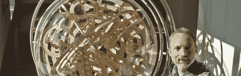

# 黑客日链接:2010 年 2 月 14 日

> 原文：<https://hackaday.com/2010/02/14/hackaday-links-february-14-2010/>

**$3 万？**

是艺术还是拼图？嗯，它的功能是作为一个游戏，但它肯定是一件艺术品，并相应地定价。[超级豪华汽车](http://www.flickr.com/photos/27271328@N08/4131680267/)出现在 [Make Mazine](http://www.make-digital.com/make/vol20/?pg=46) 和 [Hammacher Schlemmer](http://www.hammacher.com/Product/78372?cm_mmc=CJ-_-1414665-_-1492714-_-Hammacher+Homepage+88x31) 中，售价为 3 万英镑(不过你不能直接点击将它添加到你的购物车中)。想想开发这款产品所付出的努力！[via[Awesomer](http://theawesomer.com/the-superplexus/26828/)

**可滚动显示更新**

继续研究他的可滚动显示矩阵。他现在有 25 块控制板，让它们像矩阵一样工作。我们最初[在 1 月份](http://hackaday.com/2010/01/17/rgb-display-development/)讨论过这个问题，但是现在更容易看到如何通过将它安装在织物或帆布上来实现便携。如果你感兴趣，可以看看[的演示视频](http://www.youtube.com/watch?v=hSwcSnBrx6o)。

**安全测试套件**

[回溯 4 最终版已经发布](http://www.backtrack-linux.org/)。如果你不喜欢边缘粗糙的，你应该再试一次。这个精简的 Linux ditro 是为安全测试而设计的，对于 noob 和 pro 来说都是可行的。[谢谢史蒂夫]

**随时开机**

[Csae]使用这个[便携式电源中心](http://saintcase.deviantart.com/art/Portable-PSU-8-151403753)点燃一些室外的演播室闪光灯。它由[一个机箱](http://saintcase.deviantart.com/art/Portable-PSU-2-151403020)，一个[不间断电源](http://saintcase.deviantart.com/art/Portable-PSU-1-151402558)，几根延长线[合二为一](http://saintcase.deviantart.com/art/Portable-PSU-5-151403377)组成。起初，你可能会认为这是一个有点贫民窟，但它是便携式的，它做的是什么打算。

**情人节快乐**

送这件装饰有 LED 心形图案的衬衫作为礼物，一定会让你的情人退避三舍。这个项目已经有几年的历史了，但是[笨拙的 t 恤](http://www.youtube.com/watch?v=BRhtgZiV5Ws)永远不会过时，对吗？