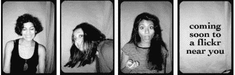
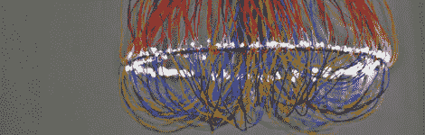

# 黑客日链接:2010 年 2 月 7 日

> 原文：<https://hackaday.com/2010/02/07/hackaday-links-february-7-2010/>

**Bot 给路人让头**

这个[自由放养的机器人](http://www.engadget.com/2010/02/07/heineken-bot-does-what-it-says-on-the-keg-soon-to-be-mans-new/)在今年的 Kinetica 艺术博览会上被发现。你可以把手放在上面，它会停下来给你倒一杯啤酒。如果你把 7/8 杯海德啤酒当作“啤酒”的话。

**照相亭增添乐趣——占用地面空间**

面对现实吧，照相亭很有趣，如果免费的话，会有很多人使用。这个特别的摊位建在某个家伙的公寓里，增加了乐趣，但却占用了地面空间。但是这将是你下一次集体聚会的一个很好的开始，就像 [Crushtoberfest](http://hackaday.com/2009/12/03/crushtoberfest-can-you-pwn-tom-selleck/) 一样。[via [DVICE](http://dvice.com/archives/2010/02/weekend-project.php)

**更人性化的通孔设计**

【冰箱头】[卡在他的耳垂](http://noproblemshere.com/blog/?p=2341)上 5 毫米的 LED，然后用一个微控制器让它发出脉冲。他有一个相当大的拖把，那是他藏黑色控制器包的地方。下一个版本应该是 RGB 和他能焊接的最小表面贴装封装。至少这个不像 [LED 乳头环](http://hackaday.com/2010/01/17/hackaday-links-january-17th-2010/)那么恶心。

**吊灯你的妻子永远不会让你安装**

这款 [300 LED 吊灯](http://www.missmoun.com/index.php?/project/wire-chandelier/)使用环氧树脂涂层的电线缠绕在光环上，看起来像一个更传统的水晶灯具。如果你想把这个挂在餐桌上，还是很难推销的。[via [Gizmodo](http://gizmodo.com/5461791/remainders-+-the-things-we-didnt-post-shout-it-out-edition/gallery/)

**一抹铜色**

[僵尸 84]用铜管做了一个机器人手臂的原型[。这里没有太多的信息，但你可以看到手腕上的一些电线，看起来像肌腱一样。这让我们想起了《T2》中的角色。](http://www.flickr.com/photos/zomie/4278528586/in/set-72157611259811533/)