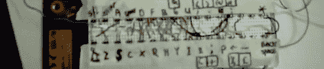
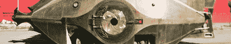

# 黑客日链接:2012 年 1 月 2 日

> 原文：<https://hackaday.com/2012/01/02/hackaday-links-january-2-2012/>

#### 史上最差的电脑键盘

[Gerardus]发现了一台旧的 BBC Master Compact 电脑，售价 15 美元。唯一的问题是这台电脑没有键盘。如果你能用一个旧的试验板做一个键盘[，这不是问题。不是 M 型的，但是能用。](http://www.youtube.com/watch?v=_M80D10Ynpo)

#### 紧急带状电缆维修

#### 

[托马斯]在医院工作。一天晚上，一台设备因为坏的带状电缆而停机。医生们对他大喊大叫，让他把设备启动并运行起来，所以出于沮丧，他拿着订书机走向电缆。它一直坚持到替换人员到来。看看这些图片:[一张](http://hackaday.com/wp-content/uploads/2012/01/imag0116.jpg)和[两张](http://hackaday.com/wp-content/uploads/2012/01/imag0115.jpg)。

#### 没人记得*小尼莫:贫民窟历险记*

这是[艾伦]巨大的[鹦鹉螺艺术车](http://blog.makezine.com/archive/2011/11/nautilus-art-car-pressure-door-with-huge-mechanical-iris.html)，带有巨大的机械光圈。只要看一下[的视频](http://vimeo.com/32134162)，就会大吃一惊。我们不会冒险猜测这些黄铜和铜花了多少钱，但我们可以确认 Arduino 控制了虹膜。查看[构建页面](http://www.almostscientific.com/project/the-nautilus-aperture-door-2011/)。

#### 点亮街头艺术

[格里西尼]为一个展示[班斯基]街头艺术的灯箱挂上了一个指示性的。我们会选择一些 RGB leds 和[[基斯·哈林](http://www.banksy.co.uk/outdooimg/dog2.jpg)图案，但会更有力量。

#### 剧院风力发电机

这台[风力机](http://s1104.photobucket.com/albums/h336/Willrandship/)是【Willaim】为他高中的合唱音乐会建造的。它基本上是一个混凝土形式的管子，上面贴着塑料盖，一根管子作为轴。机器借助一些尼龙裤子发出风的声音。