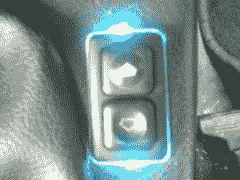
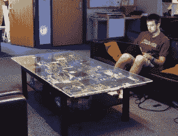

# 黑客日链接:6 月 13 日星期一

> 原文：<https://hackaday.com/2011/06/13/hackaday-links-monday-june-13/>

蒂姆写信告诉我们这个简单的方法，他把一辆 87 年的宝马上的库存按钮灯换成了很酷的蓝色 LEDS。他使用了一些电容器，以达到电荷释放需要一点时间的效果，这样灯在关闭后还会亮一会儿。灯光本身看起来真的很好，所以检查图片。

这里有一个很棒的咖啡桌[使用一个大的电路板建造。它肯定会在任何人的书房里看起来很好，尽管它很可能有一个低的妻子认可系数(WAF)。这实际上是基于“在](http://chrisharrison.net/index.php/Fun/CircuitTable "Circuit board coffee table")之前已经覆盖了[的主板墙，但是“咖啡桌”形式可能看起来更好。](http://hackaday.com/2008/08/13/motherboard-walls/ "motherboard wall")

最后，休息之后是一段视频，是[有人在清洗](http://nullohm.com/ "washing an interactive window")一个互动艺术展。不确定这算不算黑客，但是当某人清洗屏幕/窗户时，看到灯光跟着他看起来很酷。

[https://www.youtube.com/embed/4IPTcTC9bkY?version=3&rel=1&showsearch=0&showinfo=1&iv_load_policy=1&fs=1&hl=en-US&autohide=2&wmode=transparent](https://www.youtube.com/embed/4IPTcTC9bkY?version=3&rel=1&showsearch=0&showinfo=1&iv_load_policy=1&fs=1&hl=en-US&autohide=2&wmode=transparent)