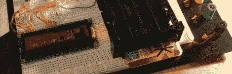

# 黑客日链接:2010 年 10 月 17 日

> 原文：<https://hackaday.com/2010/10/17/hackaday-links-october-17-2010/>

**你应该转动的牌**

****

[这些贺卡](http://www.mechanicards.com/)一定是某个机械工程师胡作非为的产物。它们配有曲柄，旨在通过简单而优雅的动作娱乐大众。[谢谢菲尔]

**磁卡磁条读卡器**

****

[JP]建立了一个基于 Arduino 的[磁卡读卡器](http://hackmiami.org/2008/12/21/magnetic-stripe-card-reader/)。它使用现成的零件，但如果您不介意购买组件，这将使您在短时间内启动和运行。如果你想要更多的信息，还有这个[青少年版](http://hackaday.com/2010/07/24/teensy-credit-card-reader/)。

**自制气枪哨兵枪**

****

这款哨兵枪拥有惊人的快速射速，可以持续相当长一段时间，这要归功于容纳大量弹药的大手电筒外壳。[谢谢大卫]

**扫描仪复活节彩蛋**

****

惠普的工程师们玩了一点小游戏，在这台扫描仪中制作了一个复活节彩蛋。如果你知道你在做什么，你可以让它播放欢乐颂。它需要加入本月早些时候我们的链接帖子中的[老硬件乐队](http://hackaday.com/2010/10/03/hackaday-links-october-3-2010/)。[谢谢 Googfan]