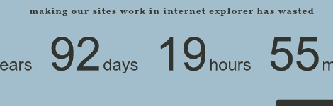

# 黑客日链接:2010 年 10 月 24 日

> 原文：<https://hackaday.com/2010/10/24/hackaday-links-october-24-2010/>

**方形齿轮**

这个视频展示了方形齿轮和其他奇怪形状的齿轮。我们想不出它的用途，但它仍然很有趣。[via [修补匠学](http://tinkernology.blogspot.com/2010/10/non-circular-wooden-gears.html)

**用激光烹饪**

****

很晚了，你已经在工作台上呆了很长时间了。但是为什么要去厨房吃零食呢？拿几个 1 瓦的激光器，把玉米粒热粘在 DC 发动机上，然后[你马上就能得到爆米花](http://www.youtube.com/watch?v=isCO0PIgddM)。

**称之为模拟器并不公平**

好的，那么[这个链接是雷克萨斯的广告](http://www.youtube.com/watch?v=zGZIztjoHb8)。不过看看这个驾驶模拟器的片段还是值得一看的。在这个舱里是一辆被 360 度屏幕包围的真实汽车。房间有一个完整的 x 和 y 轴，当你在模拟世界中驾驶时，可以移动吊舱(和汽车)。这就像有人给了一群极客无限的预算，并说“去坚果”。[谢谢卢克]

在你的黑客冒险中，什么最耗时？

****

每个从事过网页设计的人都遇到过与 Internet Explorer 相关的特殊渲染错误和解决方法。Internet Explorer 偷走了我的生活旨在将开发人员生活中浪费的集体时间制成表格。我们认为这很可笑，因为花同样多的时间满足 [W3C 标准](http://www.w3.org/standards/webdesign/)，这个问题就会消失。但是[Caleb]看到这个网站时提到了一些有趣的事情:在你的黑客冒险中，哪一部分最浪费时间？我们很想在评论中听到它。