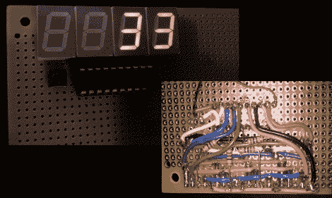

# 黑客时代的阅读器:电子骰子

> 原文：<https://hackaday.com/2011/04/10/hackaday-reader-throwdown-electronic-dice/>

黑客读者[Daid] [在我们的论坛](http://forums.hackaday.com/viewtopic.php?f=3&t=580)上展示了他最近制作的一套电子骰子。早在一月份，[我们展示了一套类似的电子骰子](http://hackaday.com/2011/01/17/electronic-dice-has-option-for-20-or-100-sides/)，它是由一个 Arduino 构建的，就【Daid】而言，它的功率远远超过了它。不满足于简单地说可以做得更好，[他说到做到](http://daid.mine.nu/blag/2011/04/08/hardware-electronic-dice/)，这是我们希望看到的。

他使用 ATTiny2313 来提供设备的逻辑，在一组四个 7 段显示器上输出骰子值。整个设置由一个按钮控制，该按钮提供三重功能滚动骰子，配置骰子有多少面，以及选择投掷多少骰子。

他承认布线工作有点乱，但他追求的是功能而不是形式，而且效果很好。他还说，如果不是因为那些爱管闲事的孩子搞砸了 7 段展示，他会更早完成这部电影。

我们认为他做得相当不错，不过如果你认为你能做得更好，我们洗耳恭听。