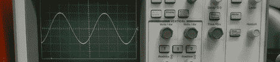

# 黑客日链接:2012 年 3 月 10 日

> 原文：<https://hackaday.com/2012/03/10/hackday-links-march-10-2012/>

#### 我们在显示器上砸钱，却什么也没发生！

有时候，我们会收到一些黑客发来的非常棒的消息，但是除了 YouTube 上的一个视频，我们没有别的可写的了。于是开始了[飞*回到未来*的德罗宁四轴飞行器](http://www.youtube.com/watch?v=eA4U-6GmkUw)的故事。可悲的是，故事也以视频结尾。(如果您有任何信息，请发送进来！)

#### 好吧，我们会再送一辆酷车

奔驰[用 led](http://www.youtube.com/watch?feature=player_embedded&v=ZIGzpi9lCck)罩住一辆车，让*的詹姆斯·邦德隐形车[改天](http://www.youtube.com/watch?v=GbAiYjovbBM)死。*梅赛德斯的视频制作成本高达数万美元，所以*当然*有摄像机的诡计；我们只是想知道 Adobe After Effects 在这个版本中获得了多少信任。

#### 微软触摸屏演示可能是不可能的

是的，微软确实很在乎用户体验。看看他们应用科学小组的视频。他们用每 1 毫秒更新一次的触摸屏进行了用户测试，相比之下，我们的手机和平板电脑通常更新约 100 毫秒。当然，结果是一个更好的 UX，但现在我们想知道*他们如何建立一个每毫秒更新的触摸屏？*那是 1 kHz 的刷新率，我们不知道他们是如何实现的。我们可能正在处理微软的 Surface 投影仪/红外相机，但这并不能回答任何问题。

编辑:[Philip Rowney]发送了一个提示，可能是这个 TI 触摸屏控制器可以采样 1 kHz 以上。唯一的问题是，这款芯片使用的是电阻式触摸屏，而不是支持多点触摸的电容屏。至少这解决了*一个*的问题。

#### 现在来看看*可以*测量 1 kHz 的东西

【古技术专家】贴出了一个[示波器保养和馈电的优秀指南](http://www.paleotechnologist.net/?p=2103)。我们的大多数读者可能已经知道了他们令人敬畏的 Techtronix 和惠普部门的来龙去脉，但这并不意味着年轻一代迟早不会学习。

#### 好主意，除了把它留到春天

机缘巧合之下，[瓦伦丁]想出了如何戴着羊毛手套使用触摸屏。答案是:在食指指尖涂上导热油脂。它工作正常，看起来也不太糟糕。明年冬天我们会记得这个。

#### 最后一个没有图片，所以这里是这个

[Darrell]用一点点乳胶和红宝石为他的电阻系列制作了[彩色标签](http://needsmorelasers.com/articles/13/latex-ruby-to-generate-color-coded-resistor-labels)。我们突然想到用试管来组织电阻器。这很酷，让一切看起来都很科学。