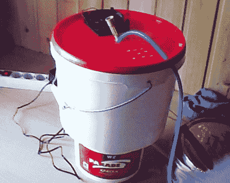

# 黑客交流和灰分过滤器

> 原文：<https://hackaday.com/2010/08/14/hacked-ac-and-ash-filter/>

莫斯科现在处于一个有点热的地方，正在处理热浪和巨大的野火。烟雾、灰烬和热量的结合快把安德鲁逼疯了，所以他建造了一个奇妙的装置来缓解压力。它有两个腔室，底部是冰水，顶部是空气挡板。一个小型直流风扇将空气泵入上部腔室，在那里空气遇到从下部容器喷入的水。结果是热交换类似于我们见过的其他 [diy 空调设置](http://hackaday.com/2010/05/25/cool-yourself-with-a-cpu-cooler-and-beer-fridge/)。但是安德鲁也注意到，在运行设备一段时间后，烟和灰烬的味道消失了。这种装置能被看作是捕集空气中烟雾颗粒的有效方法吗？