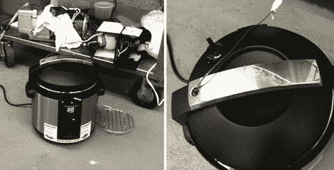

# 破解一个更好的高压锅

> 原文：<https://hackaday.com/2011/08/15/hacking-a-better-pressure-cooker/>

[戴夫·阿诺德]伟大的烹饪博客上的这个[高压锅黑客](http://www.cookingissues.com/2011/08/12/voiding-your-warranty-hacking-electric-pressure-cookers/)发给了我们(谢谢，[techartisan]！).大多数高压锅食谱都是为压力高达 15 PSI 或 250 F / 121 C 的高压锅编写的，在这些温度下，食物中会发生许多有趣的化学反应。流行的 Cuisinart 电压力锅达不到这些压力和温度，所以[戴夫·阿诺德]着手使他的 Cuisinart 更好。

在用热电偶测量温度后，[戴夫]推断出 Cuisinart 炊具只达到了 237 华氏度和 9 磅/平方英寸。在看了一下[电子设备](http://www.cookingissues.com/wp-content/uploads/2011/08/Cuisihack.jpg)后，他意识到在温度传感器电路中增加一个电阻会给他想要的压力。在焊接到一个修整过的锅里后，一切都进行得很顺利，炊具能够达到 15 磅/平方英寸。

[Dave]不确定他的改进能否持续——他不知道这种炊具能否经受住过热的考验(首先对不粘高压锅有一些担忧)。也就是说，从 Cuisinart 中获得更多的能力是一个很棒的模式。