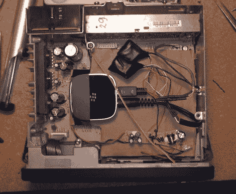

# 将 A2DP 支持破解到一个旧的汽车音响中

> 原文：<https://hackaday.com/2011/08/22/hacking-a2dp-support-into-an-old-car-stereo/>

[Roofus]有一辆旧车，不幸的是，他的立体声磁带播放机不适合他。他总是想简单地进入他的车，拿出他的手机，让他的音乐准备好播放，没有任何忙乱。在摆弄了各种不同的磁带适配器后，他厌倦了，决定自己装配一个 A2DP(立体声蓝牙音频)适配器。

他把主机拉了出来，开始四处张望，看如何才能接上适配器。他认为最好的办法是拆除磁带舱，让立体声系统误以为插入了磁带。在花了一些时间追踪电线和研究他的旧磁带适配器如何工作后，[Roofus]有了一个 A2DP 连接，并准备好摇滚了。

迎接他的只有沉默，他转向他最喜欢的黑客网站(当然是 Hackaday)寻求帮助。一些友好的论坛用户帮助他确定了一个接地环路问题，他出发去最近的 RadioShack 找一对隔离变压器来解决他的问题。

一旦他解决了地面回路的问题，他的适配器工作得非常好。他把所有东西都放回了一起，除了他安装的一个在音频源之间切换的小开关，你永远不会知道它在那里。