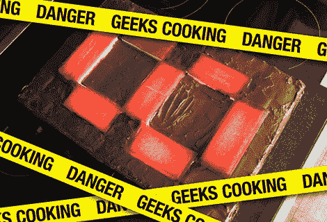
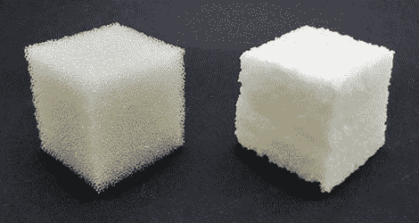
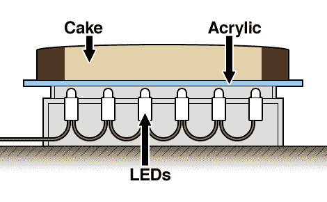
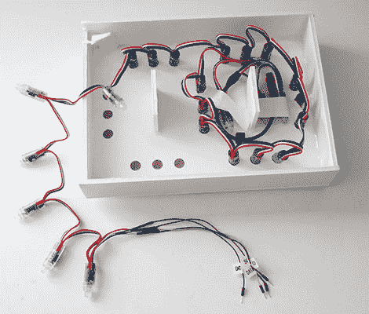
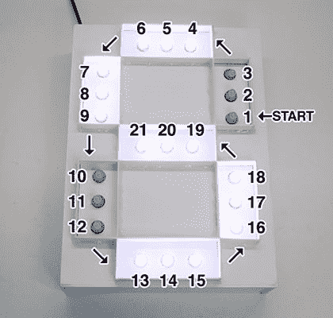
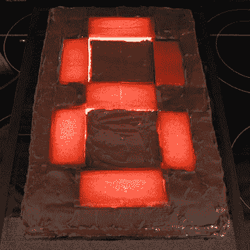

# 用发光二极管砍蛋糕，续集！

> 原文：<https://hackaday.com/2011/06/12/hacking-cakes-with-leds-the-sequel/>



几周前，我们发表了一篇关于*制作*和*烘焙*的融合的文章，试图让[创造出一个装饰着发光二极管](http://hackaday.com/2011/04/23/hacking-cakes-with-leds/)的蛋糕。这个故事的寓意是，并不是每一个创造性的想法都以胜利而告终，但是我们赞扬了这种把自己的错误发布到整个互联网上让大家看到并从中学习的精神。

[克雷格]的 LED 矩阵被证明是不可靠的……底层蛋糕的情况也好不到哪里去，就像《时光大盗》中烤箱里烧焦的那块蛋糕。如果不是偶然的联想，带灯蛋糕迷因可能已经在那里消亡了…

在故事发生的时候，我们中的一些人正在进行一个不相关的 LED 项目，该项目涉及光扩散器[和](http://hackaday.com/2011/01/31/how-to-build-a-ping-pong-ball-display/)的实验，试图将不同的 LED 光点扩散成更柔和的光。起草羊皮纸和磨砂丙烯酸都工作得很好，但小块室内装潢泡沫已被证明特别有效。

在观看蛋糕项目和处理方形泡沫之间，一个想法被开玩笑地抛出:从下面给蛋糕打背光，使用天使蛋糕作为光扩散器，就像我们一直在实验的泡沫一样。密度、光学特性(和味道)看起来非常相似！



(On the left: polyurethane upholstery foam, the sort used in sofa cushions. On the right: angel food cake. Or…wait…is it the other way around?)

在 [Maker Faire](http://hackaday.com/2011/05/20/bay-area-maker-faire-hackaday-has-arrived/) 的创造性余晖中(或者更有可能只是疲惫)，这个想法不知何故从*半开玩笑地*跳到了*demo or die。*这个概念大概是这样的:



一个定制的基座可以固定 led，同时为蛋糕提供一个更突出的位置。一层玻璃或透明丙烯酸将两者分开，因此 led 在未来的项目中保持清洁，蛋糕不会被任何种类的助焊剂或铅或其他电子残留物弄脏。符合 RoHS 标准的蛋糕！

两个问题仍然存在:

*   我们会做什么样的展示？静态照明会很无聊，我们知道这个*有*需要动画。作为对这类事情的第一次尝试，我们选定了一个[单七段显示器](http://hackaday.com/2011/05/03/egg-clock-its-egg-ceptional/)，倒计时。
*   使用什么类型的发光二极管？为了快速制作原型，我们没有把一堆分立的发光二极管连接起来，而是选择了串行可寻址的发光二极管。即便如此，还是要做出一些决定:


(Left: BlinkM "smart LED." Right: MaceTech ShiftBrite. Top: RGB “pixels” available in various types from Adafruit, Bliptronics and Cool Neon.)

选择使用哪种类型更多地是基于可用性而不是工程:我们的 [Adafruit RGB 像素](http://www.adafruit.com/products/322)被另一个项目占用了，我们手头没有足够的 [BlinkMs](http://hackaday.com/2011/03/30/converting-the-blinkm-into-the-worlds-tiniest-arduino/) 或 [ShiftBrites](http://hackaday.com/2010/02/25/shiftbrite-coffee-table/) 来构建我们的原型，也不想等待发货。我们刚刚在 Maker Faire 上买了一串[酷霓虹的](http://www.coolneon.com/)新的“完全控制照明”led，并渴望在某些事情上尝试它们，所以他们默认获胜。回过头来看，由于漫射灯泡的原因，这些对于这个特定的项目来说并不理想，但是我们称赞它们是最容易编程的。多年来，我们研究了许多不同的可寻址 LED，并发现没有一种 LED 可以统治所有的 LED——每一种 LED 对于不同的任务都有独特和理想的属性。

然后，我们在 Adobe Illustrator 中制作了一个 LED 固定模板，大小适合一页纸:


这是印刷好的，粘在一张垫子板上，然后用业余爱好刀费力地切出发光二极管的孔。一个[激光切割机](http://hackaday.com/2011/03/02/open-source-laser-cutter-v2/)或者仅仅一个[钻床](http://hackaday.com/2010/11/29/drill-press-for-through-hole-pcb-manufacturing/)会使这变得容易得多。作为比例参考，每个部分大约 1.5 英寸宽，这只是第一个原型，我们没有花心思在花哨的斜角上。

切割 LED 孔后，从[泡沫芯](http://hackaday.com/2011/03/22/paper-mechanical-iris/)板上切割出侧壁和一些支架，并使用热胶枪组装。这些给基座增加了大约两英寸的高度，以容纳子弹形的 LED 外壳和下面的电线。然后，我们将每个 LED 打孔到位:



这是我们第一次犯错的照片证据。除了这个荒谬的想法。这些 LED 灯串两端都有连接器，用于菊花链连接，每个灯串都有不同的“输入”和“输出”端。由于我们热衷于连接微控制器，没有考虑清楚这一点，我们切掉了“In”端，焊接了自己的试验板电线。从电子学的角度来说，这样做很好，但更好的主意是切断“输出”连接器，使其成为我们的芯片到 led 适配器。然后，这个字符串仍然可以在任何链的末端正常工作，以及与酷霓虹自己的驱动电路(使用插头)，我们将有一个适配器加密狗，用于这些字符串的未来应用。吸取教训。


该串有 25 个发光二极管。我们的显示器有七个区段，每个区段有三个发光二极管。最后四个发光二极管只是在基座下揉成一团，并没有在这里使用，但可以被制成地面效果照明或其他合适的东西。

在 led 的物理安装之后，我们编写并测试了代码，该代码运行在一个 Arduino 上。我们稍后将深入研究其来源。

此图片显示了指示灯的安装顺序，并通过代码进行寻址。此外，每个部分周围的小盒子(更多的垫纸板和热熔胶)限制了灯光向外扩散的光芒，并支撑着蛋糕的顶部丙烯酸树脂:



我们在亚克力的底部添加了接触纸，以进一步控制杂散光。这可能有点过了，但作为一种模板，确实有助于以后定位蛋糕部分。我们不确定丙烯酸是否是食品安全的，所以我们最终的后代可能生来就有尾巴之类的东西。为科学付出的小小代价！


烘烤就这样开始了。欢笑随之而来…


(Devil’s food and angel food. In the same cake. You know this can’t end well.)

已经确定的部分将是天使蛋糕。蛋糕的非分割部分需要是不透明的……不仅仅是为了容纳光线，也是为了给蛋糕添加糖霜，因为没有糖霜的蛋糕根本就不是蛋糕！我们选择了巧克力，但是几乎任何东西都可以…红色天鹅绒，胡萝卜蛋糕，你能想到的。虽然不是水果蛋糕，但它有一个[强烈的引力场，甚至连光都无法逃离](http://hackaday.com/2008/09/12/large-hadron-collider-roundup/)。


巧克力蛋糕制作顺利。烘烤和冷却后，我们切掉蛋糕中间隆起的部分，使其横截面更加均匀……这也为我们进入下一阶段提供了必要的支撑。


你会注意到没有制作天使蛋糕的照片。哦，当然，[克雷格]可能是个足以展示他的失败的男人，但不是我们。我们通常不喜欢那些电视广告，这些广告把“一家之主”在面对家务时描绘成一个低能儿，好像所有的男性都是废船一样。连自己吃饭穿衣都不会的畜生。我们在这里看到了一些[令人敬畏的烹饪技巧](http://hackaday.com/2011/04/05/pid-sous-vide-slow-cooker-bon-appetit/)，知道这根本不是真的。然后我们试着烤了一个天使蛋糕…

天使蛋糕(这个名字显然是一个吸引我们的营销阴谋)是一个奇怪而陌生的东西，毫无疑问是美国宇航局研究的产物，它也给我们带来了气凝胶和航天飞机隔热砖。盒子里装着看起来像硅藻土的东西，里面加水了。没有鸡蛋、油或任何类似于*的食物。*这是在搅拌器中起泡，倒入平底锅，烘烤(在此期间，它膨胀到原始体积的 6000 倍以上)，然后从烤箱中取出，让其冷却(非常重要的是，它是侧放的，不管出于什么外星议程的原因),它继续永远嘲笑你，作为一个无法穿透的粘性物质，对抗所有切割或移除的尝试，就像 *X 战警中的 loaf-pan 版本。我们真的可以听到垃圾处理器在处理这个的时候咀嚼的声音。持续*五分钟。**


在那次经历之后，我们正式宣布暂停一周的男子气概骄傲。如果你看到一个人把他的肤色和肤色混在一起洗，或者用微波炉加热他的口袋并称之为“晚餐”，他完全是 T2 的笑柄。你得到了我们的许可。

所以，又去了一趟杂货店，带回来一个预先做好的天使食物面包蛋糕(放了一天，特别耐用)…我们会注意到，这比一开始就买混合物要便宜…我们可以继续了…

两个蛋糕都被切成合适大小的块，并排列在丙烯酸基底/模板上。为了帮助保持天使食品块没有污点和干净的糖霜，我们在切巧克力蛋糕之前先在上面预先撒上糖霜，并且会在切完之后修补接缝。不得不在巧克力蛋糕的最后几个长方形上发挥创意，但是糖霜掩盖了所有的罪恶。天使蛋糕应该被修剪得薄一点，以匹配巧克力蛋糕的高度，但在整个阉割的惨败后，我们变得饿了，只是想看看这东西是否会工作。


用 LED 基座上的蛋糕进行的快速测试显示了一个问题:白色蛋糕吸收了房间里所有的漫射光，完全抵消了背光。但我们以前见过这个问题……尤其是一个 [SparkFun 电容计套件](http://www.sparkfun.com/products/9485)，它也遇到了同样的问题，在明亮的房间里，它的红色 LED 段被白色扩散器冲掉了。解决的办法是在显示器上加一块烟熏丙烯酸树脂。因此，我们在这里应用了类似的原理，但为了保持所有东西都可以食用，我们使用了水果卷，而不是丙烯酸。现在回想起来，果冻的味道会更好，而且会和蛋糕的其他部分很好地切片。



水果修复并没有完全解决问题，仍然需要在[近乎黑暗的](http://hackaday.com/2011/04/06/blu-ray-laser-plotter-writes-on-glow-in-the-dark-screen/)中操作蛋糕以获得最佳效果，这可能是也可能不是问题，因为程序员通常在[弱光条件下茁壮成长](http://hackaday.com/2010/10/02/diy-night-vision-monocle/)。上面的照片显示了数字“6”在正常的室内光线下的样子…被洗去了，几乎无法与完整的“8”区分开来。使用更亮、更定向的发光二极管(但仍然使用水果浇头)可能会有所帮助……BlinkMs 或 ShiftBrites 或它们的[高流明](http://thingm.com/products/blinkm-maxm.html) [等效物](http://macetech.com/store/index.php?main_page=product_info&cPath=1&products_id=9)。不过不要太多，否则你会被烤箱烤坏的。

这是一个完成倒计时蛋糕的视频:

[https://www.youtube.com/embed/d_o7c2cz0nU?version=3&rel=1&showsearch=0&showinfo=1&iv_load_policy=1&fs=1&hl=en-US&autohide=2&wmode=transparent](https://www.youtube.com/embed/d_o7c2cz0nU?version=3&rel=1&showsearch=0&showinfo=1&iv_load_policy=1&fs=1&hl=en-US&autohide=2&wmode=transparent)

所以这个想法确实……有点……可行。我们能再试一次吗？大概不会。这是一个有趣的想法——hack T1——任何一天你到 T2 吃蛋糕，并把它称为你的工作 T3，这确实是一个好日子，但最终的效果不值得努力。和原来的文章一样，我们希望这篇文章可以归入“英雄失败”一栏。尽管这是一个进步，可能会给某些人*一些启发。也许第三次是最有魅力的。*

最后一个想法是，这可以与前一篇文章中的 [Wave Shield](http://hackaday.com/2011/04/25/portal-turret-plushie-is-cute-and-harmless/) 或 [chipKIT 数字音频技术相结合，播放生日快乐歌，创造一个既能使*和*变胖又令人难以置信地讨厌的蛋糕！](http://hackaday.com/2011/06/08/chipkit-sketch-mini-polyphonic-sampling-synth/)

最后，这是驱动 LED 显示屏的 Arduino 草图:

```

// 7-segment LED Cake Sketch for Arduino.
// Uses Cool Neon's &quot;Total Control Lighting&quot;
// addressible LEDs.  Data issued on Arduino
// digital pin 11, clock on pin 13.

#include &lt;SPI.h&gt;

// 7-segment bitmask for each digit.
// Bit-to-segment mapping is as follows:
//     1
//   2   0
//     6
//   3   5
//     4
// This corresponds to the order in which LEDs
// are mounted in the physical template.
byte segmask[] = {
  B0111111, B0100001, B1011011, // 0 - 2
  B1110011, B1100101, B1110110, // 3 - 5
  B1111110, B0100011, B1111111, // 6 - 8
  B1110111, B1111010,           // 9, ersatz 10
  B0100001, B0110000, B0011000, // Spinny thing
  B0001100, B0000110, B0000011
};

#define N_PIXELS  25
#define GAMMA    2.4
byte gamma[256];

void sendPixel(byte r, byte g, byte b)
{
  SPI.transfer(~((r &gt;&gt; 6)              |
                ((g &gt;&gt; 4) &amp; B00001100) |
                ((b &gt;&gt; 2) &amp; B00110000)));
  SPI.transfer(b);
  SPI.transfer(g);
  SPI.transfer(r);
}

void sendLatch()
{
  for(byte i = 0; i &lt; 4; i++) SPI.transfer(0);
}

void setup()
{
  int i;

  // Initialize SPI communication:
  SPI.begin();
  // The following 3 lines can normally be
  // left out - Arduino's default SPI config
  // appears to be MSB, Mode 0 and runs at
  // 4 MHz (instead of 8 as is done here,
  // but still plenty quick).  But for
  // posterity, here's the full config:
  SPI.setBitOrder(MSBFIRST);
  SPI.setDataMode(SPI_MODE0);
  SPI.setClockDivider(SPI_CLOCK_DIV2); // 8 MHz

  sendLatch(); // Wake up!

  // Set all pixels to initial &quot;off&quot; state:
  for(i = 0; i &lt; N_PIXELS; i++) sendPixel(0, 0, 0);
  sendLatch();

  // Calculate gamma correction table.
  // Provides a perceptually more linear
  // fade between brightness levels.
  for(i = 0; i &lt; 256; i++) {
    gamma[i] = (byte)(255.0 *
      pow((float)i / 255.0, GAMMA));
  }
}

byte digit = 10,
     prev  = 10;

void loop() {
  byte i, bit, x;
  int  fade;

  // Fade from previous to current digit:
  for(fade = 0;fade &lt; 256; fade++ ) {

    // For each of 7 segments:
    for(bit = 0x01; bit &lt; 0x80; bit &lt;&lt;= 1) {

      x = 0; // Assume segment is off by default
      if(segmask[digit] &amp; bit) { // On, or fading on
        x = (segmask[prev] &amp; bit) ? 255 : gamma[fade];
      } else if(segmask[prev] &amp; bit) { // Fading off
        x = gamma[255 - fade];
      }

      // 3 LED &quot;pixels&quot; per segment
      for(i = 0; i &lt; 3; i++) sendPixel(x, x, x);
    }

    // Last 4 pixels are unused and stay off
    for(i = 0; i &lt; 4; i++) sendPixel(0, 0, 0);

    sendLatch(); // Update LEDs
    delay(1);    // ~1000 updates/sec
  }

  // Hold last image for remainder of ~1 sec.
  delay(1000 - 256);

  if(digit &gt; 0) { // Still counting down
    prev = digit;
    digit--;
  } else { // Done counting, reset...
    // But show spinny animation first
    for(int n = 0; n &lt; 5; n++) {
      for(digit = 11; digit &lt;= 16; digit++) {
        for(bit = 0x01; bit &lt; 0x80; bit &lt;&lt;= 1) {
          x = (segmask[digit] &amp; bit) ? 255 : 0;
          for(i = 0; i &lt; 3; i++) sendPixel(x, x, x);
        }
        for(i = 0; i &lt; 4; i++) sendPixel(0, 0, 0);
        sendLatch();
        delay(100);
      }
    }
    digit = prev = 10;
  }
}

```

使用总控制照明 led 的几点注意事项:

*   红线= +5V。白色=数据(Arduino 引脚 11)。绿色=时钟(Arduino 引脚 13)。蓝色=地。
*   数据手册建议发布 32 个连续的 0 位来标记一整帧数据的开始，但我们有时会在初始图像上看到一个杂散的第一个或最后一个像素。一种更可靠的方法是在程序开始时发出 32 个零，然后在每个完整帧的后发出*。稳如磐石。*