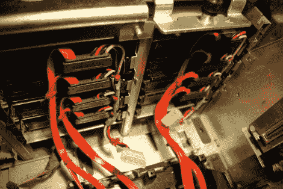

# 黑客攻击旧的服务器硬件用于新的家庭用途

> 原文：<https://hackaday.com/2011/12/19/hacking-old-server-hardware-for-new-home-use/>

[Arnuschky]正在寻找一种包含冗余的网络存储解决方案。他本可以购买新的 NAS 盒，但不想支付全价。相反，他拿起一台 Dell PowerEdge 2800，将其改装为 SATA 驱动器和静音操作。

这种硬件可以低价二手也就不足为奇了。it 的底板需要 SCSI 驱动器，升级到新的服务器硬件比不断更换这些驱动器更便宜。这对 Arnuschky 没有任何帮助，所以他从移除 SCSI 连接器开始。当他这样做的时候，他把电线焊接到 PCB 上的 HDD 活动灯衬垫上。这些将被连接到 RAID 控制器用于状态指示。上图显示了安装了八个 SATA 驱动器(但没有背板)的服务器；请注意，每列中的所有电源连接器都链接在一起，总共有两个驱动器电源连接器。然后，他在每个连接器上涂上胶水，然后拧紧背板，直到胶水变干。现在，该设备拥有可交换的 SATA 驱动器！

他的服务器转换跨越了几篇文章。顶部的链接是一个综述，所以请确保您点击查看除了 SATA 转换之外，他如何进行风扇速度黑客攻击。

如果你的公差不允许你像这样粘合连接器，检查一下[这个使用垫片间隔的另一个 hack](http://hackaday.com/2011/08/13/making-sata-drives-work-with-a-scsi-backplane/) 。