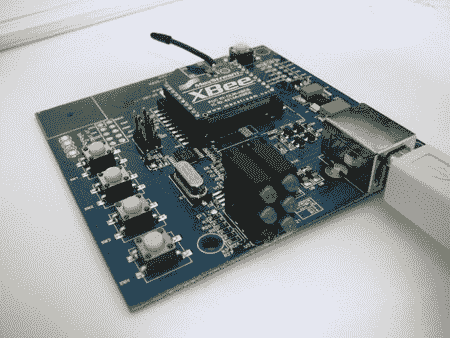

# 黑客 Pleo 进行人脸识别和远程控制

> 原文：<https://hackaday.com/2008/08/07/hacking-pleo-for-face-recognition-and-remote-control/>

班贝格大学跨学科心理学小组 GRIP 已经整理了几个关于[黑客 Pleo](http://www.grip-online.com/en/pleo_hack) 的教程。对于那些不熟悉的人来说， [Pleo](http://www.mahalo.com/Pleo) 是一个形似恐龙的小型机器人。他们的目标是让它变得可爱，并在比消费类机器人更高的水平上模拟情感。Pleo 的制造商鼓励黑客入侵装置和控制软件。查看他们网站的“开发人员”区域，下载各种工具在您的 Pleo 上工作。

GRIP 发布的两个教程涵盖了添加与 PC 的无线通信和为设备添加更高分辨率的摄像头。我们的目标是让这个平台能够进行面部识别。

[第一个教程](http://www.grip-online.com/en/pleo_hack/spycam)是取代网络摄像头。GRIP 在记录这一升级方面做得非常出色。有大量的图片，涵盖了每一步，实际上有 15 页。Ugobe 的人也做得很好，当它被拆卸时，很难不对这个可怜的家伙感到一丝同情。

他们有几个方面也进行了更新，例如他们后来回来并内置了一个新的电源以避免干扰。更新与说明一致，而不是被钉在最后。真好。当一个教程快结束的时候，发现作者发布了一个不同的、更好的方法来完成早期步骤，这总是很痛苦的。

[第二](http://www.grip-online.com/en/pleo_hack/xbee)和更短的教程是他们增加了与 PC 的通信。他们使用 XBee 射频模块接入 Pleo 的串行端口。这种安装不需要对 Pleo 的结构进行任何修改，只需要焊接 2 根电线。一旦连接上，你就可以使用鲍尔公司的 [Dino-MITE](http://www.bauerindependents.com/MAIN/Downloads01.htm) 向 Pleo 发送命令。

GRIP 在本教程中做了出色的工作。他们要求我们也通过参加他们的调查来帮助他们研究我们对未来机器人的希望和反对意见。

[感谢马丁·迪鲁夫]

*   [永久链接](http://www.grip-online.com/en/pleo_hack)