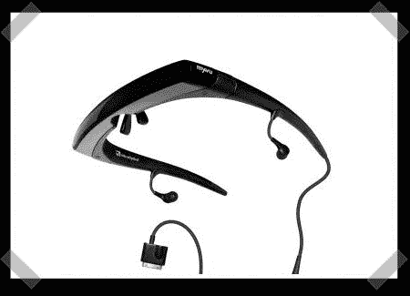

# 入侵 Myvu 个人视频播放器

> 原文：<https://hackaday.com/2008/08/19/hacking-the-myvu-personal-video-player/>

【jongscx】拿起一个 Myvu 个人媒体浏览器，迅速开始策划改进。他决定让[能够在设备](http://teamhackaday.com/forum/viewtopic.php?f=2&t=2955&st=0&sk=t&sd=a)上观看任何输入，而不仅仅是一个 Ipod。

在对不同的输入进行了一番折腾之后，他最终打电话给 Myvu 问了一些问题。令人惊讶的是，他得到了设计这个东西的工程师。这位工程师非常乐于助人，很乐意帮助他破解这个设备。[jongscx]最终让它工作起来，并将原理图公布于众。

他说他现在正忙于其他一些项目，但希望他很快会写一份官方报告，并附上最终产品的照片。

[DrNathan]来信指出[RetroPlayer]负责大部分工作以及联系工程师。

[谢谢，内森博士]

*   [永久链接](http://teamhackaday.com/forum/viewtopic.php?f=2&t=2955&st=0&sk=t&sd=a)