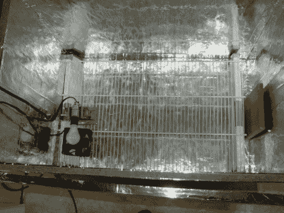

# 拼凑一个臭虫消灭者

> 原文：<https://hackaday.com/2010/11/22/hacking-together-a-bedbug-exterminator/>

我们在新闻中看到了太多关于臭虫日益猖獗的报道。这有点激怒我们，因为这些“新闻”的旋转总是我们将不得不与这些昆虫生活在一起，你无法避免它。公牛玉米！[艾德·尼斯利]被臭虫骚扰，但他没有失去理智，而是用它来摆脱困境。除虫过程中的一个步骤是[开发一个臭虫杀死箱](http://softsolder.com/2010/11/20/bed-bugs-hot-box-disinsector/)，它将里面的东西提高到害虫的杀死温度以上。他建造了一个隔热室，用一个格栅将目标材料从底部升起，并允许在物品的所有边缘进行热交换。测试了 60、100 和 120 瓦的灯泡组合以及用于空气循环的风扇。他把结果用图表表示出来，并计划用他学到的知识为盒子制造一个更有效的加热器。

但是热箱不是他唯一的辩护。他的家庭开发了屏障，通过高度或粘性区域来阻挡昆虫。看看[他收集的臭虫帖子](http://softsolder.com/2010/11/21/bed-bugs-wrapup/)，不要再害怕这些东西了！我们可以反击，我们可以用普通物品和智慧来反击。

[谢谢史蒂文]