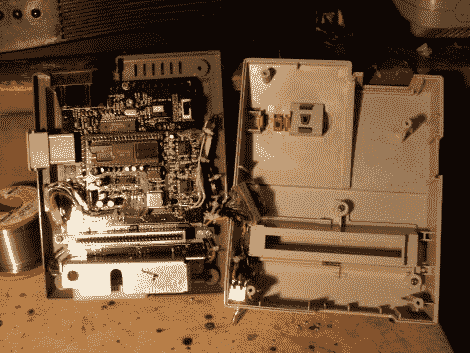

# 黑进你的 NES/Famicom 控制台以获得更好的视频和音频

> 原文：<https://hackaday.com/2011/07/18/hacking-your-nesfamicom-console-for-better-video-and-audio/>

[Dominic]写了一篇文章来分享一个非常漂亮的 Famicom 控制台模型，它改善了系统的视频和音频输出。虽然你们中的一些人可能熟悉 PlayChoice 10，但我们猜测你们中的许多人并不熟悉。PlayChoice 10 是一款街机风格的机器，允许您玩多达 10 种不同的 NES 游戏。该系统的硬件与 Famicom/NES 控制台非常相似，但图形和声音性能优于任何一台控制台。

[Dominic]决定调整他的 Famicom 系统，并最终用 PlayChoice 10 的图像处理单元(PPU)替换了它的原生图像处理单元。这使得控制台能够以原生方式输出 RGB 视频，从而产生色彩更明亮、更清晰的图像。然而，他并没有就此止步。他的 Famicom 系统还拥有升级的音频电路，拥有伪立体声，低音响应增强，整体音频清晰度更好。

根据 Dominic 的说法，这款游戏机看起来几乎是库存，性能也相当不错。请务必查看下面嵌入的视频比较，看看这些修改如何提高了他的系统的性能。

[https://www.youtube.com/embed/7v7e-bjB13s?version=3&rel=1&showsearch=0&showinfo=1&iv_load_policy=1&fs=1&hl=en-US&autohide=2&wmode=transparent](https://www.youtube.com/embed/7v7e-bjB13s?version=3&rel=1&showsearch=0&showinfo=1&iv_load_policy=1&fs=1&hl=en-US&autohide=2&wmode=transparent)