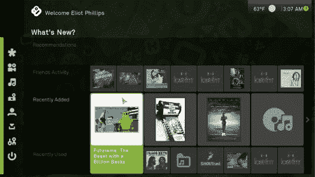

# Hackit: Boxee 现在在 Windows 上

> 原文：<https://hackaday.com/2009/06/24/hackit-boxee-now-on-windows/>

免费的媒体中心管理和流媒体应用程序 Boxee T1 现在可以在 Windows 平台上使用了，该应用程序是 T2。自从去年这个时候[首次宣布其 alpha](http://hackaday.com/2008/06/17/boxee-social-media-center-public-alpha/ "Boxee social media center public alpha  - Hack a Day") 以来，我们一直在关注 Boxee 的发展。当时，它只适用于 OSX，并承诺支持 Ubuntu。我们对界面表示怀疑，“不幸的是，所有动态调整大小、动画、滑动、浮动的信息框使它的行为像缩放用户界面的弱智表弟”。我们对 Boxee 的兴趣几乎完全是基于它是 XBMC 的一个分支，媒体中心项目最初是为被黑的 Xboxes 开发的。有趣的是，Boxee 成为被黑的苹果电视的首选接口，然后在 CES 上成为主流。

你一直在使用 Boxee 作为你的媒体中心吗？你喜欢/讨厌什么？像 [XBMC](http://xbmc.org/ "XBMC Media Center for Mac OS X, Windows and Linux") 、[综合体](http://www.plexapp.com/ "Plex Media Center for OS X")或[神话电视](http://www.mythtv.org/ "MythTV, Open Source DVR")这样的备选方案呢？