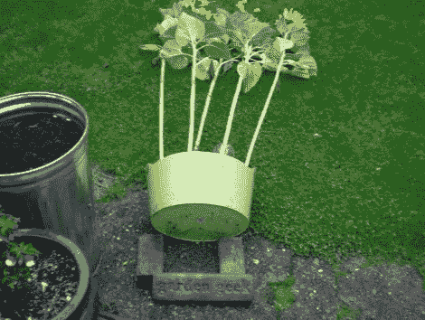
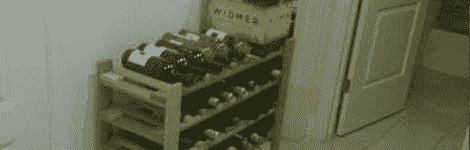
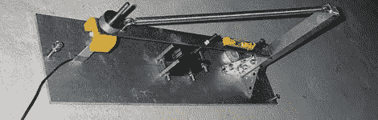
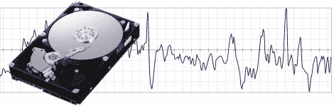
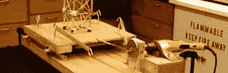

# 有链接-地震启示版:2011 年 8 月 23 日

> 原文：<https://hackaday.com/2011/08/23/had-links-quakepocalypse-edition-august-23-2011/>

如果你没注意到新闻的话，东海岸发生了一点小变动。由于 30 秒的隆隆声，我刚回到家，这是东海岸 114 年来从未有过的。我们认为我们为你整理了一些与地震相关的链接，以代替这次不那么具有破坏性但却震撼地球的事件。

**防震酒架**

首先，如果地震不断毁坏你酒架上的所有葡萄酒，用户[jofish]有一个[快速补救方法](http://www.instructables.com/id/Earthquake-proof-Wine-Rack/)。他研究了一些现有的商业产品，并简单地通过将廉价的 O 形圈钉在架子的前面来复制它们。我们假设酒架的背面也固定在墙上。

**垂直地震仪**

****

 **下一个是来自 mikesense.com[迈克]的垂直地震仪。这是对他去年在下加利福尼亚经历的更具威胁性的 7.2 级地震的回应。垂直地震计以电子或机械方式测量重物的运动，然后用磁铁或其他方法抑制振动。这种特殊的设计被称为由[杰夫·巴顿]开发的 AS-1。Matt 的页面提供了您需要了解的所有内容的链接，包括构建视频。

**用硬盘预测地震活动**

如果您正在寻找一些非常规的方法来跟踪地震活动，我们有两篇文章详细介绍了使用磁盘驱动器的加速度计进行地震跟踪。[迈克尔·斯塔德勒]意识到所有这些传感器的潜力,并发布了一个程序，该程序创建了一个点对点网络，汇集来自传感器的数据。我们不太愿意看到有人跟踪我们的笔记本电脑，但是 2006 年亚洲有 2500 名用户下载了这个软件。[的第二篇文章](http://www.wired.co.uk/news/archive/2010-09/22/servers-predict-earthquakes)详细描述了由 IBM 领导的一项监控服务器机架中固定硬盘驱动器的工作，这些硬盘驱动器通常保持静止不动。

**简易 DIY 地震模拟器**

最后，对于那些想要制造(微型)地震的人，我们挖掘了这个 MTU 项目，使用胶合板、电钻、橡皮筋和一些轴承来制作 DIY [振动台](http://www.geo.mtu.edu/~jdiehl/ETM.pdf) (PDF 警告)。我们确信有大量的改进可以做，但如果你有一堆数控零件(我们希望我们有)，这是一个非常有趣的项目。**