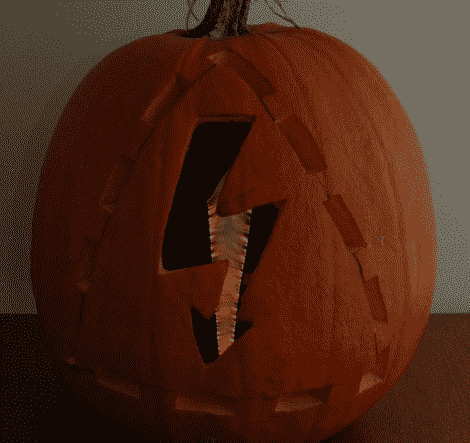

# 万圣节黑客:雅各布的灯笼肯定会赢得雕刻比赛

> 原文：<https://hackaday.com/2011/11/03/halloween-hacks-a-jacobs-lantern-sure-to-win-the-carving-contest/>

[Matt]参加了今年的南瓜雕刻比赛，尽管他的艺术技巧有点…欠缺。他知道自己赢得比赛的机会很小，除非他有一个伟大的噱头让他的创作脱颖而出，所以他开始头脑风暴。

[Matt]认为，由于他的设计必须简单一些，他需要一些引人注目的东西，以便在南瓜经过手术刀后添加到南瓜中。就像一道闪电，灵感来了，他出发去取一个点火变压器和一些金属衣架。

他制作了一个临时的雅各布梯子，可以完美地放入他挖空的南瓜中，然后在南瓜上刻上“小心，电击危险”的标志，这是大多数从事电子产品工作的人都熟悉的标志。你可以在下面的视频中看到最终的结果，我们认为它看起来非常整洁。如果他最终没有赢得比赛，我们会感到震惊！

[https://www.youtube.com/embed/_GySz5wFzBk?version=3&rel=1&showsearch=0&showinfo=1&iv_load_policy=1&fs=1&hl=en-US&autohide=2&wmode=transparent](https://www.youtube.com/embed/_GySz5wFzBk?version=3&rel=1&showsearch=0&showinfo=1&iv_load_policy=1&fs=1&hl=en-US&autohide=2&wmode=transparent)