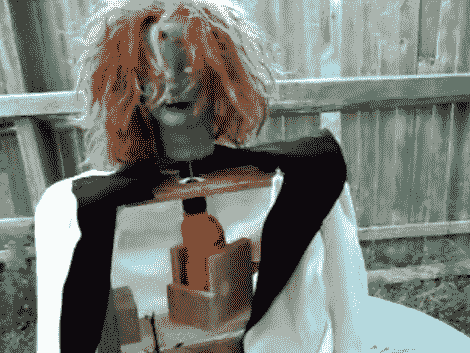

# 万圣节道具:这个练习会让你头晕目眩

> 原文：<https://hackaday.com/2010/10/25/halloween-props-this-drill-makes-your-head-spin/>

[Nollie551]给了我们一个他的头部旋转道具的演示。在你的万圣节展示中加入一个被附身的孩子是个不错的选择。但是当她的头开始旋转(想想:[驱魔人](http://www.imdb.com/title/tt0070047/))时，就像“不给糖就捣蛋”的人在旁边闲逛，应该会把他们吓得魂飞魄散。你可以看到，它只是一个夹具来固定一个便宜的电钻。他没有包括这是如何连接的细节，但我们认为这将是一个伟大的方式来使用[钻开关黑客](http://hackaday.com/2010/08/31/controlling-an-ac-drill-using-one-pwm-connection/)，这是【本·克拉斯诺】不久前做的。

休息后请加入我们，观看一些视频。

[https://www.youtube.com/embed/9xLFJK0Uj68?version=3&rel=1&showsearch=0&showinfo=1&iv_load_policy=1&fs=1&hl=en-US&autohide=2&wmode=transparent](https://www.youtube.com/embed/9xLFJK0Uj68?version=3&rel=1&showsearch=0&showinfo=1&iv_load_policy=1&fs=1&hl=en-US&autohide=2&wmode=transparent)