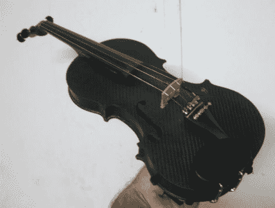

# 手工制作的碳纤维小提琴是一件令人惊叹的工艺作品

> 原文：<https://hackaday.com/2011/12/08/hand-made-carbon-fiber-violin-is-a-stunning-work-of-craftsmanship/>

手工制作一把小提琴绝非易事，但是用碳纤维制作一把小提琴却是一个惊人的壮举！Carpenter [Ken]以前从未制作过小提琴，也没有用碳纤维制作过任何实质性的东西，他认为最好的学习方法就是实践。

在用雕刻的石膏塞制作小提琴前后板的玻璃纤维模具之前，他花了很多时间测量和绘制他的设计。这个过程非常耗时，他需要制作 10 种不同的灌注成型碳纤维车身板，才能对它们产生的声音感到满意。

随着小提琴主体较大部分的建立，他开始制作肋骨模具，在注射树脂之前，每个模具花了他 5 个小时来安装。琴身完成后，[肯]准备在小提琴上开 f 孔——这个过程需要手拿 Dremel 在一个水缸前弓着背花很多时间。

正如你在上面的图片中看到的，最终的结果是惊人的——我们只是希望我们可以听一听，看看它听起来是否像看起来一样好。