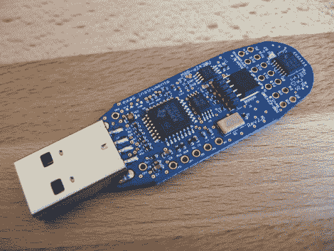
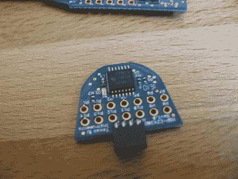

# EZ430-F2013 动手操作

> 原文：<https://hackaday.com/2011/01/30/hands-on-with-ez430-f2013/>

月初[我们遇到了一个免费](http://dangerousprototypes.com/2011/01/03/msp430-usb-dev-stick-giveaway/) [eZ430-F2013 开发棒](http://focus.ti.com/docs/toolsw/folders/print/ez430-f2013.html)的优惠券代码。TI 不时地提供这些东西，所以我们抓住机会收购了一个。昨天收到的，我们花了一点时间看了一下。上面你可以看到第一个项目完成；诺基亚手机屏幕上的 Hello World。休息之后，请加入我们，了解我们对该设备的想法，以及更多图片和细节。


开发板以 USB 加密狗的形式出现。但这不是包装的范围。它装在 DVD 盒里，还有一张 CD，上面有用户指南和“网络资源”。我们不需要这个，但是好吧。但是等等，它不是这样运送的。DVD 盒装在一个 9 英寸×9 英寸×10.5 英寸的盒子里，通过联邦快递连夜优先运送。这似乎有点浪费，尤其是考虑到我们没有为硬件或交付支付一分钱。一个马尼拉纸信封就足够了，但是如果它是免费的，我们就不能对这些东西做决定。



在里面，你会发现主板上有一个 USB 接口，构成了编程器本身。后端是小型可拆卸板，用于承载 F2013 微控制器。这种情况是一个有点挑剔的删除，但一点点撬做的把戏。

```
0451:f430 Texas Instruments, Inc. MSP-FET430UIF JTAG Tool
```

插上电源后，子板上的 LED 会按照示例固件的意图愉快地闪烁。我们很高兴看到加密狗被 Ubuntu 10.04 识别为 UIF 设备，MSPdebug，我们用来用 Launchpad 编程的[软件，可以与之对话。是时候让这个小家伙做点什么了。](http://hackaday.com/2010/08/11/how-to-launchpad-programming-with-linux/)



这是微控制器板。注意用于连接编程器板的小间距 4 引脚插座。还要注意未组装的 0.1 英寸间距焊盘。


这是添加两个 7×1 引脚插座后的电路板底面。这是我们发现一个好的设计考虑的地方。因为我们没有这么大的 IDC 插座(可以插入主板上的引脚接头),所以我们使用引脚插座，只插入跳线。现在它们已经安装好了，我们意识到从底部引出的引脚和芯片从顶部引出的引脚是一样的；左上角的针脚 1 和右上角的针脚 14。是时候把它挂在什么东西上并开始编码了。


我们拿出了我们过去一直使用的旧诺基亚 3595 LCD 屏幕，因为它使用 3.3V，这是该芯片的高端。移植代码很容易，因为[已经和另一个 MSP430 芯片](http://hackaday.com/2010/09/28/launchpad-not-limited-to-value-line-chips/)一起使用了。几分钟后弹出“你好，世界”。回顾一下:它是免费的，可以在 Linux 工具上运行，而且代码似乎可以在几个不同的芯片上运行。赢了！

## 我们对硬件的想法

那么，我们如何看待这一开发包呢？如果是免费的，太好了！我们有点困惑，因为它似乎是一次性硬件。除了 TI 具有细间距连接器的子板之外，没有人考虑将编程器用于任何其他用途。我们很可能最终将引脚头粘到塑料外壳上，并将这些引脚焊接到适当的连接上，使其更加坚固。我们确实有这样的感觉，一只手不知道另一只手在做什么，因为发射台*感觉*像是高级硬件。也就是说，这两种开发板都没有让离线编程和调试变得容易，所以目前我们认为这两种都是新事物。

不过，你必须给他们信任，通过免费赠送，我们现在已经有了一个 MSP430 芯片，下次我们做一个小项目的原型时就可以用了。这可能正是我们几年前订购的 1.8V 串行 EEPROM，当时我们以为会得到 5V 版本。

## 资源

这没什么特别的，可能对任何人都没用，但是这里是 hello world 代码的 [git 库。](https://github.com/szczys/F2013-hello-world)

## 跟我来