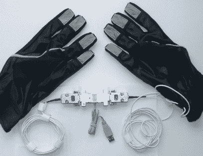

# HandUSB 数据手套接口

> 原文：<https://hackaday.com/2008/07/12/handusb-data-gloves-interface/>

继[今天关于数据手套](http://www.hackaday.com/2008/07/12/clove-2-glove-for-one-handed-input/)的早期帖子之后， [HandUSB 是一种手套接口](http://www-user.tu-chemnitz.de/~heha/mb-iwp/Datenhandschuh/)，旨在通过 USB 将指尖触摸数据传输到计算机。虽然手套本身对普通黑客来说不是非常有趣或有用，但该项目有一些很好的文档。电子设备都是开源的，他有 EAGLE 文件和 AVR Libc 代码的链接。你也可以找到一个为 DOS 写的演示程序。这个项目使用[AVR-USB by Objective Development](http://www.obdev.at/products/avrusb/index.html)所以如果你想从你的 USB 串行芯片继续前进，这个项目将是一个很好的学习资源。

[via [YourlTronics](http://www.youritronics.com/data-gloves-with-miniaturized-usb-controlling-device/)

*   [永久链接](http://www-user.tu-chemnitz.de/~heha/mb-iwp/Datenhandschuh/)