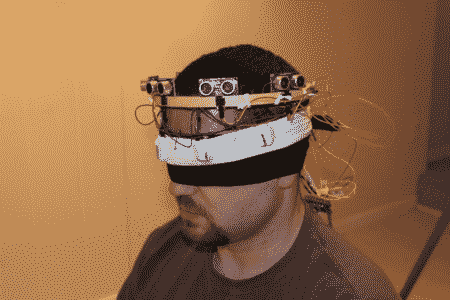

# 盲人的触觉反馈

> 原文：<https://hackaday.com/2010/12/17/haptic-feedback-for-the-blind/>

[polymythic]正在用他的触觉反馈设备帮助盲人看东西，这个设备叫做 [HALO](http://www.instructables.com/id/Haptic-Feedback-device-for-the-Visually-Impaired/) 。该设备的核心是一个 Arduino Mega 2560，它通过几个超声波测距仪感应物体，然后使用旧手机的一些振动马达将信息传回给用户。用户可以通过马达脉冲的频率来感受距离。马达脉冲越快，物体越近。

这种感应几乎可以应用到任何传感器上，让用户感觉到原本看不见的东西。虽然触觉反馈是[没有什么新的](http://hackaday.com/2007/09/18/haptic-radar-electronic-whiskers/)很高兴看到继续与新的传感器和不同的设置工作。