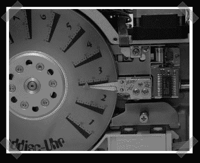

# 硬盘时钟(不是带高清表盘的蹩脚时钟)

> 原文：<https://hackaday.com/2007/09/15/hard-drive-clock-not-a-lame-clock-with-a-hd-face/>

【弗雷德】[送来了这个](http://www.heise.de/ct/machflott/projekte/55956)牛逼的硬盘时钟。不，只是一个时钟的一部分，但实际的驱动机制和头部是用于这一个。指针向内和向外移动以指示分钟，盘的位置用于显示小时。它使用一个 50hz 的时钟、逻辑芯片和一些搜罗来的部件来完成这一切。

*   [永久链接](http://www.heise.de/ct/machflott/projekte/55956)