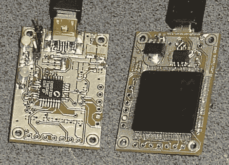

# Linux 基于硬件的随机性

> 原文：<https://hackaday.com/2010/02/06/hardware-based-randomness-for-linux/>

在数字世界中，真正的随机性很难实现。[安迪·格林]正在通过使用这个随机的 USB 加密狗使[获得真正的熵变得更加容易。Whirlygig 使用一个](http://warmcat.com/_wp/whirlygig-rng/) [CPDL](http://hackaday.com/2008/12/11/how-to-programmable-logic-devices-cpld/) 从一组振荡器中收集数据。由于温度变化，振荡器具有不断波动的频率；如果它们跑得更快，就会产生更多的热量，这反过来又会使它们慢下来。这一点，加上与轮询 USB 设备相关的可变延迟，带来了极大的随机性。该设备被检测并安装在“/dev/hw_random”下，然后可以使用 [rng-tools](http://sourceforge.net/project/showfiles.php?group_id=3242) 包输入到“/dev/random”中。安迪做了很多测试，包括硬件测试和随机性测试。我们没有看到订购这个的选项，但他有[硬件](http://git.warmcat.com/?p=whirlygig-hardware.git;a=summary)和[固件](http://git.warmcat.com/?p=whirlygig-cpld.git;a=summary)库，所以你可以自己组装一个。

[谢谢 Zunk]