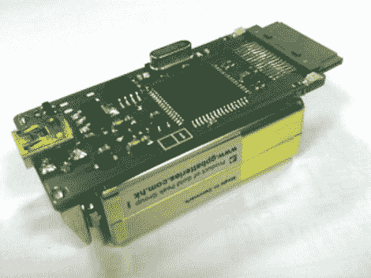

# 硬件越狱缓解重启之痛

> 原文：<https://hackaday.com/2010/03/11/hardware-jailbreak-eases-reboot-pains/>

这个[设备可以越狱一部 iPhone](http://www.myboyfriendisageek.com/2010/hack/on-tube/) 。它不需要电脑，既可以重启使用 blackra1n 漏洞进行一次性启动越狱的手机，也可以越狱出厂的新设备。我们不能说这解决了 blackra1n 导致的网络共享问题(需要回到电脑前重启手机)，但它确实减轻了痛苦。我们看到了一些关于电路板布局的信息，但没有零件清单或固件。休息后观看演示，如果您有更多关于部件或代码的信息，请留下评论。

[https://www.youtube.com/embed/0BK_FCXcyrk?version=3&rel=1&showsearch=0&showinfo=1&iv_load_policy=1&fs=1&hl=en-US&autohide=2&wmode=transparent](https://www.youtube.com/embed/0BK_FCXcyrk?version=3&rel=1&showsearch=0&showinfo=1&iv_load_policy=1&fs=1&hl=en-US&autohide=2&wmode=transparent)

[谢谢胡安]