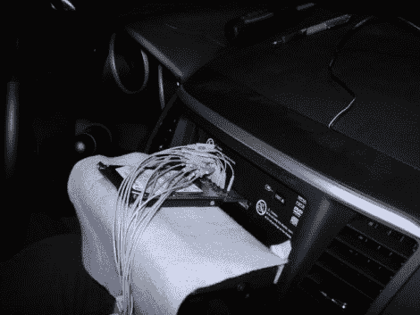

# 三菱多通信系统上的硬盘解锁

> 原文：<https://hackaday.com/2011/04/29/hdd-unlocking-on-the-mitsubishi-multi-communication-system/>

它已经有几年的历史了，但[Brian 360]在他的三菱多通信系统上解锁硬盘的方法[相当有趣。三菱将他们的](http://mitsubishiforum.com/forum/showthread.php?t=22994) [MMCS](http://www.mitsubishi-motors.com/corporate/about_us/technology/safety/e/mmcs.html) 描述为人车通信工具。它基本上是一个仪表板屏幕和控制显示导航地图和播放音乐。[Brian]发现他 2008 款 Lancer 中的 MMCS 硬盘被锁定，无法克隆并换成更大的硬盘。听起来熟悉吗？硬盘锁定已经在许多系统中使用，包括最初的 Xbox，我们一会儿就回来。

上面看到的设置用于从系统本身获取硬盘密码。定制的适配卡被构建并插在硬盘驱动器和 MMCS 硬件之间，每条数据线都有测试点。[Brian]连接了一个数字存储示波器，经过一段时间的摸索，找到了一种在要求输入密码时触发示波器的方法。他解释了将捕获的数据转换成 ASCII 字符串密码的过程。

有了这个，你怎么解锁硬盘呢？最受欢迎的工具是 hdparm，这是一个用于早期 Xbox 解锁的工具，但今天仍在其他硬件上使用。现在，brian 有了磁盘映像备份，并且能够更换为更大的硬件。

[感谢叛逆 8]