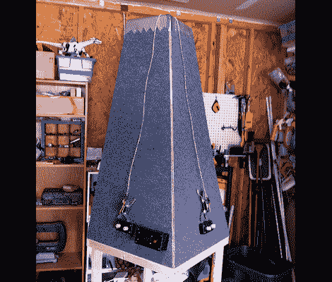

# 从你的游戏室安全的头对头爬山

> 原文：<https://hackaday.com/2011/08/13/head-to-head-mountain-climbing-from-the-safety-of-your-game-room/>

当你可以在自己的爬山游戏上惊叹于山顶的景色时，为什么还要冒冻伤和高原反应的风险呢？

[Jeff]制作了这个令人愉快的作品，休息后你可以看到它的效果。他结合了几个非常简单的想法，并且做得非常好。登山者都是机械的。他们用每个树枝末端向下的大头钉抓住山的表面(上面覆盖着地毯)。它们的运动是由构成攀登者身体的两个微型伺服系统提供的。每个控制器中的两个电位计直接影响顶部和底部肢体的运动。该游戏在比赛过程中播放音乐，并通过感应手臂何时接触到山顶的金属雪帽来精确检测获胜者。

显然，重量是设计过程中的一个问题。犹豫了一会儿后，杰夫决定把登山者拴起来，以免电池卷到每个人身上。但他克服了山内加重电缆管理的问题。

[感谢摩根 via [Make](http://blog.makezine.com/archive/2011/08/rock-em-sock-em-robot-rock-climbers-game-cabinet.html)