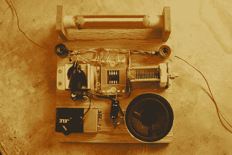

# 听到了吗？这是一台 555 定时调幅收音机

> 原文：<https://hackaday.com/2011/02/25/hear-that-its-a-555-timer-am-radio/>

[Eric]最近基于一个 555 定时器建造了一个[AM 收音机，并在每日黑客 Flickr 池中发布了一些图片。他使用 555 定时器作为调幅解调器和功率放大器，以驱动扬声器。一个手绕电感器被用来调谐信号，该信号然后被叠加在由他构建的电路产生的斜坡信号上。[Eric]指出，他之所以选择 CMOS 555 定时器，是因为该定时器在这种特殊应用中具有卓越的性能，因为它的使用方式有点非传统。他分享了他的电路图和一个很棒的视频，展示了他设计的每个部分，最后是一个无线电演示，如下图所示。](http://tubetime.us/?p=85)

这是另一个将参加 [555 设计竞赛](http://hackaday.com/2011/01/25/555-design-contest-win-1500-in-prizes/)的伟大项目——简单而优雅。我们喜欢看这些，所以继续吧！

如果你想看更多由一天一次的读者制作的很酷的项目，一定要[看看我们的 Flickr 池](http://www.flickr.com/groups/hack-a-day/pool)以及[论坛](http://forums.hackaday.com)。

[https://www.youtube.com/embed/YC72J2VOSH0?version=3&rel=1&showsearch=0&showinfo=1&iv_load_policy=1&fs=1&hl=en-US&autohide=2&wmode=transparent](https://www.youtube.com/embed/YC72J2VOSH0?version=3&rel=1&showsearch=0&showinfo=1&iv_load_policy=1&fs=1&hl=en-US&autohide=2&wmode=transparent)