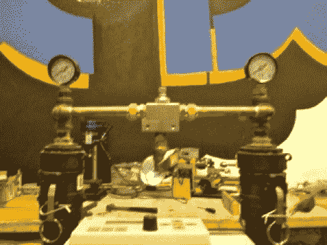

# 无热压缩空气干燥器

> 原文：<https://hackaday.com/2012/02/22/heatless-compressed-air-dryer/>

来自标准空气压缩机的压缩空气适合大多数用途。但是像等离子切割这样的应用需要低湿度的空气，而实现这一点的硬件可能会非常昂贵。[Roland]和他在 TX/RX 实验室(德克萨斯州休斯顿的一个黑客空间)的同伴刚刚[建造了这个空气干燥系统](http://txrxlabs.org/wiki/index.php?title=Heatless_Air_Dryer)。

它使用干燥剂工作；一种隔离水分的物质。它是你在鞋盒之类的地方找到的小包里的东西，上面有警告你不应该吃它。上图显示了两个装有干燥剂的房间。一次只使用一个，这样当它去除湿气的能力下降时，系统可以切换到另一个室。甚至还有一个内置的自动充电系统，它使用一部分干燥空气来去除未使用的干燥剂室中的湿气。

上面的链接有一个功能图。它的分辨率很低，文本几乎不可读，但我们已经问[罗兰]他是否可以转贴图像。这似乎是一个其他黑客空间会感兴趣的版本。