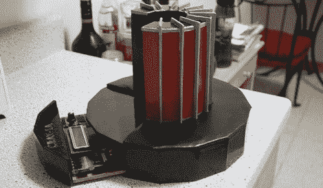

# 帮助[Chris]启动他的 Cray-1 超级计算机

> 原文：<https://hackaday.com/2012/01/10/help-chris-boot-his-cray-1-supercomputer/>

需要你的帮助。在构建了 1/10 比例、周期精确的 [Cray-1 超级计算机](http://hackaday.com/2010/09/29/tiny-cray-1-courtesy-of-an-fpga/)和[找到一个装有 Cray 软件的磁盘](http://hackaday.com/2011/09/08/recovering-data-for-a-homemade-cray/)后，他准备开始加载操作系统。不过，有一个小问题:没有人知道如何启动这个东西。

[Chris]在 archive.org 的帮助下发布了一张 Cray-1/X-MP 的磁盘映像。现在他需要你的帮助——如果你认为你可以对文件系统进行逆向工程,[Chris]会给他一大笔钱，在他的 MakerBot 上印上一个蜡笔的微型模型。无论如何，这似乎是一个有趣的挑战。

从我们用十六进制编辑器快速浏览的磁盘图像来看，似乎[Chris]手上有一些特别的东西。我们在标题中看到了一些对“Cray 内存和寄存器”以及“IOP-0 内核，版本 4.2.2”的引用，以及一些引用 1989 年 7 月的日期。这与源磁盘组的历史一致。如果您认为您已经具备了对 Cray-1 的文件系统进行逆向工程的条件，那么这就是您的机会。