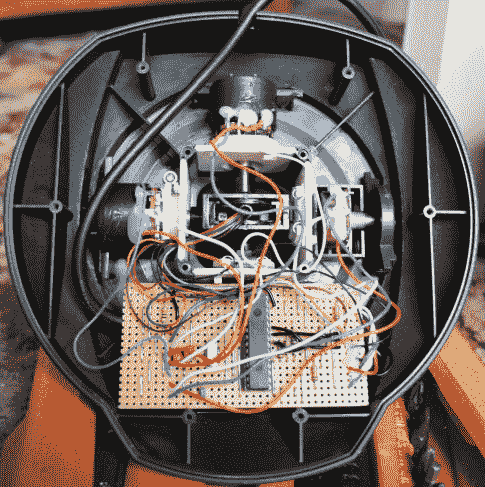

# HID 工艺与图片和操纵杆

> 原文：<https://hackaday.com/2010/06/02/hid-crafting-with-a-pic-and-a-joystick/>

[Amr Bekhit]将他的 [gameport 游戏手柄改装成 USB 游戏手柄](http://helmpcb.com/Electronics/USBJoystick/USBJoystick.aspx)。很像一个[通用 USB 操纵杆接口](http://hackaday.com/2008/06/14/universal-joystick-usb-interface/)，它使用一个额外的微控制器与串行总线对话，同时监控操纵杆上的控制。[Amr]关于创建 HID 描述符的讨论清晰易懂。他的设计可以转化为任何隐藏你内心欲望的习惯。试试[那台一直在角落里积灰的老外设](http://hackaday.com/2008/07/19/usb-nes-controller-plus/)。