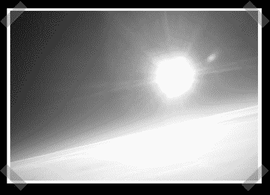

# 高空摄影气球

> 原文：<https://hackaday.com/2008/09/06/high-altitude-photographic-balloon/>

[Earl Foster]最近完成了他的第四个高空摄影气球(hap b-4)的发射。这次发射达到了 106，384 英尺的峰值高度，持续了大约 3 个小时。胶囊的最终重量为 5 磅 3-3/8 盎司，包括所有的电子设备、全球定位系统、数码相机和高清摄像机。他的气球在[联邦航空局第 101 部分](http://ecfr.gpoaccess.gov/cgi/t/text/text-idx?c=ecfr&sid=ea968eea871ed9ab2380f6d979eaa7a6&rgn=div5&view=text&node=14:2.0.1.3.15&idno=14)管理无人驾驶气球飞行的子部分 a 的豁免规则下运行。这个项目旨在通过无人驾驶气球来激发人们对科学、数学和工程的兴趣。HAPB-4 使用了一个[视差旋转印章微控制器](http://www.parallax.com/Store/Microcontrollers/PropellerTools/tabid/143/ProductID/448/List/1/Default.aspx?SortField=ProductName,ProductName)，这个多核芯片提供了八个 32 位处理器(cogs)，共享 32kB RAM 和 ROM。拥有八个独立的齿轮使他能够用最少的硬件同时记录 GPS 数据、控制相机、记录和监控传感器以及控制 LCD 功能。在这次飞行中，他确实遇到了一些设备故障，但他仍然能够捕捉到一些漂亮的照片。