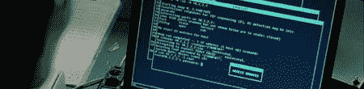

# 高调的黑客在法庭上得到他们的一天

> 原文：<https://hackaday.com/2008/06/16/high-profile-hackers-get-their-day-in-court/>

 
[针对知名黑客](http://www.darkreading.com/document.asp?doc_id=156576)【加里·麦金农】【格雷戈里·金】【罗伯特·马修·本特利】的法庭案件上周都有了重大进展，其中【金】和【本特利】被判入狱，而【麦金农】则处于岌岌可危的
状态，正在争取引渡。

[King](又名 Silenz)和[Bentley](又名 LSDigital)都将因与僵尸网络相关的罪行而服刑，但[King]使用僵尸网络进行 DDOS 攻击，[Bentley]则使用它们来创建垃圾邮件。[金]的僵尸网络有 7000 个节点，尽管法院没有公布[本特利]的僵尸网络的规模，但他所有的僵尸网络都是 Rubbermaid 公司的电脑。[金]同意判两年，而[本特利]被判 41 个月。

原籍英国的[麦金农](又名索罗)因对美国政府电脑发动“有史以来最大的军事黑客攻击”，可能会被判入狱 60 年。据称，在 2001 年至 2002 年间，他侵入了美国军方和美国国家航空航天局网络中的 97 台电脑。然而，要在美国法院受到指控，他必须先被引渡，他向英国法院提出的引渡上诉目前正在等待(T3)。

*   [永久链接](http://www.darkreading.com/document.asp?doc_id=156576)