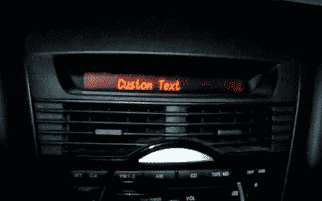

# 劫持马自达液晶显示器

> 原文：<https://hackaday.com/2010/04/16/hijacking-the-mazda-lcd-display/>

[Pieter]正在为他的座驾安装涡轮增压套件。他需要一个状态显示器来提升，但没有好的方法来安装一个额外的显示器。他想出了使用已经在仪表板上的 LCD 屏幕的主意，但是它的规格还不可用。运用他辛苦获得的黑客技能[Pieter]使用逻辑分析仪嗅出屏幕上的通信。他建造了一个控制板，可以覆盖来自主机的数据。该板还能够查询汽车的计算机数据，并以任何你想要的格式显示出来。他最终得到的是一个他可以根据自己的需要定制的普通外观。不错！