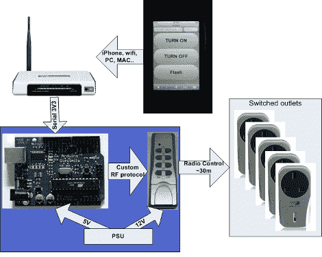

# 无需拉线的家庭自动化

> 原文：<https://hackaday.com/2010/11/09/home-automation-without-pulling-wires/>

这里有一点简单的家庭自动化，使用了我们已经非常熟悉的技巧。[Mrx23]结合 OpenWRT、微控制器和一组 RF 控制的插座开关来[为他的插件设备](http://www.instructables.com/id/Home-automation-server-with-router)增加自动化。控制开关插座的射频遥控器已连接到 Arduino。路由器通过串行连接与 Arduino 通信。路由器由网络界面控制，这意味着你可以使用智能手机或其他网络设备来控制插座。

这个系统最大的优点是路由器拥有强大的功能。由于它有一个底层的 Linux 内核，你可以选择设置 CRON 作业来打开和关闭照明，并且可以建立组设置来设置房间的照明水平，以便观看电影、招待客人等。结合这个事实，OpenWRT 可以使用端口转发进行互联网控制，这种可能性真的开始出现了。

[谢谢阿帕德]