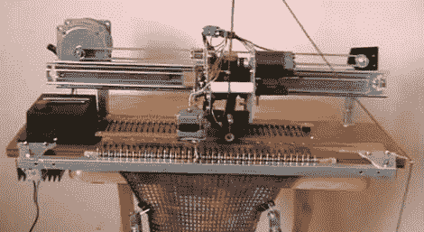

# 自制针织机

> 原文：<https://hackaday.com/2010/12/17/home-built-knitting-machine/>

哇，我们知道用不了多久我们就会看到全自动家用针织机出现。我们最近发布了一个黑客攻击，人们在[模仿一台商用针织机](http://hackaday.com/2010/12/06/knitting-machine-hack-by-keypad-emulation/)的键盘输入，这非常棒，但我们知道我们很快会看到一些被黑客攻击的机器。[corex37]没有让我们失望。它主要由旧的打印机部件、几个伺服系统和一个 Picaxe 18-x 微控制器组成。它现在似乎做得很好，但让我们希望他继续下去。如果能看到它能像另一个一样变色，那就太棒了。

[通过[使](http://blog.makezine.com/archive/2010/12/homemade_knitting_machine.html)

[https://www.youtube.com/embed/m9Fr5R--J2I?version=3&rel=1&showsearch=0&showinfo=1&iv_load_policy=1&fs=1&hl=en-US&autohide=2&wmode=transparent](https://www.youtube.com/embed/m9Fr5R--J2I?version=3&rel=1&showsearch=0&showinfo=1&iv_load_policy=1&fs=1&hl=en-US&autohide=2&wmode=transparent)