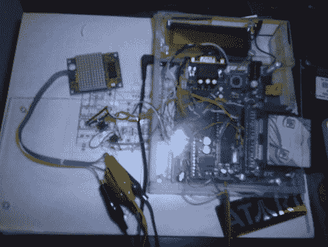

# 带有一些额外功能的自制 Mp3 播放器

> 原文：<https://hackaday.com/2011/02/04/homebrew-mp3-player-with-some-bonus-features/>

当[失聪者]着手制作他自己的自制 Mp3 播放器时，他来到了我们在研究这个主题时最常去的地方，美妙的[薄荷 Mp3](http://www.ladyada.net/make/minty/hardware.html)。基于【[阿达果工业](http://www.adafruit.com/)流行板的设计，我们呈现的是 Mp3 播放器。

项目的第一个变化是用一个 vs 1001k([)取代有时很难找到的 ST013 或更贵的 ST015T Mp3 解码器芯片，以及 CS4340 数模转换器，我们在](http://hackaday.com/2005/11/14/simple-mp3-player/)之前已经检查过了。虽然是的 VLSI 说 1001 系列是停产产品，现在可能有点难找到，[他们也在他们的网站上提供了一个更新的模型](http://www.vlsi.fi/en/products/vs1011.html)，这应该适合应用罚款。

接下来是一个有用的液晶显示屏，展示了一个 [Sparkfun 液晶背包](http://www.sparkfun.com/products/258)，它向我们展示了所有重要的音乐信息。最后还有一个 10×14 的 led 矩阵显示器，可以用来显示各种用户反馈图标，由一个 [MAX6953](http://www.maxim-ic.com/datasheet/index.mvp/id/3291) 驱动，我们认为这是一个非常漂亮的芯片。

虽然没有原理图，但有 brd 文件和源代码可供您的 PIC18F452 或类似的微控制器完成自己的工作