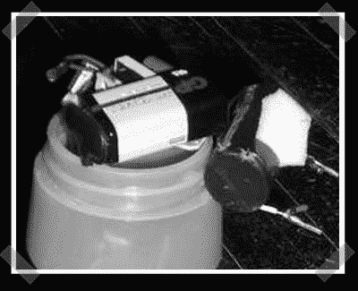

# Honeybike:自行车小偷蜜罐

> 原文：<https://hackaday.com/2008/07/26/honeybike-bicycle-thief-honeypot/>

【利斯曼】决定为自行车窃贼建造一个[蜜罐。他在一个水瓶里装了一部现收现付手机和一把被掏空的电击枪。当拨打电话时，击一下电话内部的振动马达，电击枪就会被激活。他还在手机上安装了一些追踪软件，这样自行车被盗后就能被追踪到。
电击枪探头的位置取决于某些假设:小偷会骑上自行车逃走，或者干脆把它扔到卡车后面。(如果你打算自己做这件事，请查阅当地法律。)](http://www.instructables.com/id/How-To-End-Bike-Theft-The-Honeybike-Project/)

*   [永久链接](http://www.instructables.com/id/How-To-End-Bike-Theft-The-Honeybike-Project/)