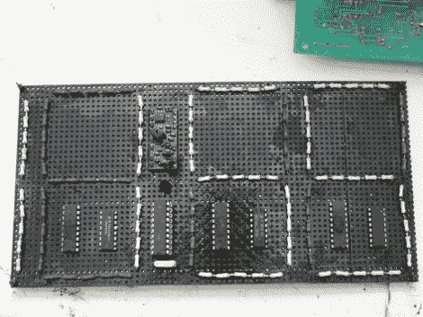

# 用于变色钟面的热电阻

> 原文：<https://hackaday.com/2010/12/05/hot-resistors-used-for-color-changing-clock-face/>

[Sprite_TM]使用热变色涂料构建了完整的[时钟显示。这是他从基于](http://spritesmods.com/?art=thermchromclk&page=1)[颜料的 7 段显示器](http://hackaday.com/2009/09/15/color-changing-paint-display/)原型的地方开始的。他从来没有真正看到这个设计完成，但他最近发现了剩余的油漆，并决定用它做点什么。他不是在印刷电路板上制作薄迹线，而是加热安装在原板上的电阻。在封装顶部进行粗略打磨后，每个电阻都涂有黑色/浅灰色油漆。让大约 500 毫瓦的电流通过一个片段，它们被加热到足以将油漆变成浅灰色。一旦关闭，这些片段会在接下来的 60 秒内逐渐消失。