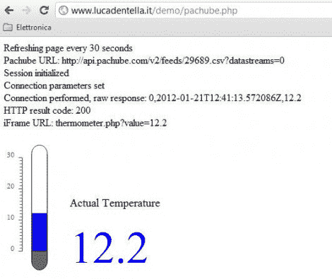

# 如何给显示项目数据的网页添加风格

> 原文：<https://hackaday.com/2012/01/27/how-to-add-flair-to-a-webpage-that-shows-your-project-data/>

这个温度显示可能不会让你大吃一惊，但它是一个简单的演示[如何使用矢量图形作为数据的网络读数](http://www.lucadentella.it/2012/01/22/dashboard-in-svg/) ( [翻译](http://translate.google.com/translate?sl=auto&tl=en&js=n&prev=_t&hl=en&ie=UTF-8&layout=2&eotf=1&u=http%3A%2F%2Fwww.lucadentella.it%2F2012%2F01%2F22%2Fdashboard-in-svg%2F))。[卢卡]写了这个四页的教程来帮助别人，他让它看起来真的很容易，一旦你把基础知识掌握到位，天空就是眼睛糖果的极限。

第一步是使用 Inkscape 创建网页将使用的动态 SVG(矢量图形)文件。这从静态背景开始，在这种情况下，温度计的灰色部分不会改变。在顶部添加了蓝色部分，只做了一点 XML 编辑，给这些部分一个钩子，将在下一步中使用。上面的演示将有一个移动的蓝色条，并改变数字输出，以匹配来自温度传感器的数据。

SVG 文件只是一个文本文件，在加载时呈现为图形。[Luca]向您展示了如何使用在制作图形时设置的标识符，在将图形发送到浏览器之前，通过服务器端 PHP 动态更改蓝色部分的大小和值。有了这些，你只需要给 PHP 文件访问数据的权限。他展示了如何使用 Pachube API，但是您也可以通过串口或其他方式轻松获得。