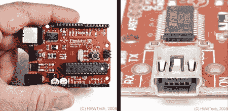
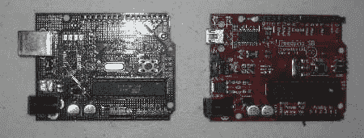
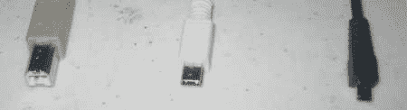
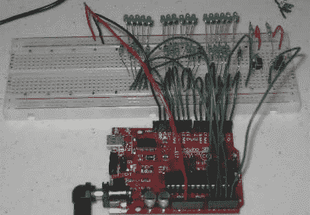

# How-To:使用 Freeduino SB 2.1 的二进制时钟

> 原文：<https://hackaday.com/2008/06/06/how-to-binary-clock-using-a-freeduino-sb-21/>

[Solarbotics](http://www.solarbotics.com/) 最近发布了自己的[版 Arduino 微控制器开发板](http://www.hvwtech.com/products_view.asp?ProductID=682)。他们基于 Freeduino 的设计开发了他们的主板。我们认为这将是一个很好的机会来审查新的董事会，并提出了如何建立一个简单的二进制时钟。在此过程中，我们将介绍一些将 led 和开关连接到微控制器的基础知识。

如果你没有听说过 Arduino，你一定在努力避免它。Arduino 是一个硬件和软件的包，允许简单的编程和快速的原型开发，降低了微控制器开发在成本和学习曲线方面的门槛。

有两种类型的 Arduino 兼容板。“软件”兼容板没有完全相同的物理布局，但它们可以运行 Arduino IDE 生成的程序。他们在 AVR 芯片上也有一个兼容的引导程序。这种类型的板的例子有 [Boarduino](http://ladyada.net/make/boarduino/) 和 [Arduino Mini](http://www.arduino.cc/en/Main/ArduinoBoardMini) 。

100%兼容的主板具有与 Arduino 参考设计完全相同的接头引脚位置和顺序。这很重要的原因是有 Arduino“保护罩”插在 Arduino 的顶部。流行的是[原盾](http://www.sparkfun.com/commerce/product_info.php?products_id=7914)和 [XBee 盾](http://www.sparkfun.com/commerce/product_info.php?products_id=8471)。Freeduino SB 是后一种类型，是一种 100%硬件和软件兼容的板。

那么如果它是 100%兼容的，为什么是 Freeduino 而不是 Arduino 呢？这是一个许可的问题。虽然 Arduino 软件和设计是免费的(就像啤酒一样)，但实际的 Arduino 名称是注册商标，需要获得许可才能使用。对于一些人来说，这还不够自由，所以他们在 [Creative Commons](http://creativecommons.org/licenses/by-sa/2.5/) 许可下创建了 Freeduino，它没有任何知识产权负担——没有版权、商标或限制性许可。这使得 Solarbotics 可以建立一个 Freeduino，并确保他们没有侵犯任何东西。

Freeduino 以“迷你套件”的形式出现，这意味着所有的表面贴装元件都已完成，只剩下十几个通孔部件需要焊接。说明书很幽默，写得很好，正好适合懂焊接的人。组装 Freeduino 至少和组装 Boarduino 一样简单，而且花费的时间更少。即使对焊接技术生疏的人来说，也有可能在一小时内组装好电路板。虽然说明书和广告上说你可以使用普通的 USB 插孔或迷你插孔，但该套件并没有同时提供这两种插孔。相反，该套件有两个版本，所以你必须在购买之前决定你想要的 USB 连接器。我们的工具包带有一个 USB 迷你连接器。

这是组装好的 Freeduino(右边红色)旁边的一辆 [Arduino NG](http://www.arduino.cc/en/Main/Boards) 。PCB 的尺寸和形状都是一样的。请注意 USB 连接器的不同之处。

事实证明，USB 连接器的选择会影响 Freeduino 板的兼容性。因为他们移动了东西，常规大小的 USB 插座外壳碰到了一些 Arduino 屏蔽，所以它们可能不合适。正如手册所说，“我们的设计将 USB-B 连接器向上推，为开关腾出空间，它会干扰一些屏蔽板。”USB 迷你连接器没有这个问题，所以如果有合适的电缆，选择哪一个是显而易见的。许多普通手机和数码相机都使用这种连接器。

Here are three USB cables: regular, mini, and micro. The middle one fits the USB mini connector on the Freeduino.

Freeduino 的一个很好的特点是 ATmega 芯片预装了“blinky”程序(这是 Arduino 宇宙的“ [hello world](http://en.wikipedia.org/wiki/Hello_world) ”。组装完成后，给电路板加电后，立即运行 blinky 程序，显示电路板可以正常工作。

虽然所有 Free/Arduino 板都兼容，但可以添加功能，正如 Solarbotics 用此板证明的那样。总的来说，他们组装的 Freeduino 是对当前一代 Arduino [Diecimila](http://www.arduino.cc/en/Main/ArduinoBoardDiecimila) 的改进。大多数用户不会真正注意到使用电容来保护电路更好。他们会注意到指示灯的位置更好，更靠近电路板的边缘。电源开关有点误导。它似乎位于电压调节器和 ATmega 芯片之间。即使开关处于“关闭”位置，仍会消耗少量电能。

那些将 Freeduino 用于实时应用的人会喜欢更精确的 16 MHz 晶振，它的误差比其他一些设计小 1000 倍左右。PCB 也有一些定制的空间，这对那些试图构建紧凑项目的人很有用。可以添加一个电位计(调整电位计),为 AD 转换器设置模拟基准电压。请注意，该套件不附带该部件。当使用非 TTL 传感器时，trimpot 可以节省一些外部器件。Solarbotics 还留有余地，如果需要，可以增加第二个更大的电压调节器。然而，不清楚棋盘上的那个的限制是什么。他们最引以为豪的功能是第 13 针上的蓝色 LED。

由于 Freeduino 有一个更精确的晶体，我们决定看看它作为时钟的表现如何。二进制时钟是最容易实现的，因为显示器只是一排相同的发光二极管。每个 LED 通过一个电阻连接到一个引脚，并连接到公共地。然后，控制器的数字输出可以打开和关闭 LED。这个计算器帮助[选择正确的电阻值](http://led.linear1.org/1led.wiz)，但是对于一个相当接近的电阻来说有足够的余地。请注意，LED 的极性很重要。

如果你不会设置时钟，它就没什么用了，所以这个时钟包括两个开关。一个开关选择要设置的数字，另一个开关用于设置数值。开关通过下拉电阻连接。[Ladyada]有一个关于使用开关的冗长而全面的教程。开关需要去抖，但我们通过软件解决了这一问题。这就是硬件设置的全部内容。请注意，我们使用了一些模拟引脚作为数字 I/O。芯片支持这一点，最新版本的 [Arduino 软件](http://www.arduino.cc/en/Main/Software)也支持。确保至少使用 Arduino 包的版本 11，否则按钮将不起作用。

Arduino 软件环境作为一个大循环运行。每次循环时，我们的程序都执行以下操作:

*   查看自上次以来经过了多少毫秒，并相应地调整内部时间。
*   如果一组 led 需要闪烁，切换它们的状态。
*   检查按钮的状态；相应地调整时间。
*   以二进制显示时间。

Arduino 库使用定时器中断为我们保存毫秒数。这并不像一开始看起来那么简单，因为 Arduino 毫秒计数器可以滚动。所以有额外的代码来检测和处理这种情况。然后我们要做的就是把它分解成小时，分钟，秒。

处理按钮是最棘手的部分。首先，我们只想在按钮刚松开的时候行动；当它被抬起、按住或刚刚被按下时不会。第二，按键要去抖。去抖是一个完全独立的主题，值得单独写一篇文章。我们使用软件去抖技巧，等待输入稳定。对于那些想了解更多的人来说，关于这个主题的权威论文在这里。

显示时间实际上是最简单的部分，因为我们所要做的就是根据时间变量中的位设置不同的引脚。整个程序可以在这里找到。Arduino IDE 编译并下载到主板上，只需点击几下。

下载程序或重置电路板后，时钟立即启动并开始计时。显示器是三组显示二进制数的发光二极管。最左边的 5 个以 24 小时(军用)格式显示小时。中间的六个显示分钟，最后一组显示秒。可以用这两个按钮设置时钟。按钮 1 选择要设置的时间部分:小时、分钟或秒。按下按钮 1 旋转通过每个部分。正在设置的指示灯组将短暂闪烁。按钮 2 用于实际更改数值。对于小时和分钟，每次按下按钮 2 都会增加数值。这确实意味着它可能需要被推 59 次来设置分钟。设置秒数时，按钮 2 只是将它们重置为 0。我们认为这比试图捕捉一个移动的数字更容易同步。

为了防止不小心更改时间，软件实现了“安全”如果大约 3 秒钟没有按下按钮，则按钮 2 被禁用，直到再次按下按钮 1。当安全装置打开时，按下按钮 1 将使当前选择的一组发光二极管闪烁，并再次打开按钮 2。

为了看看更精确的晶体是否有所不同，我们在 Freeduino SB 和 Boarduino 上运行了完全相同的程序。使用[无线电控制的“原子”时钟](http://en.wikipedia.org/wiki/Radio_clock)作为参考时间来设置和比较这些板。这是运行二进制时钟的电路板图:

Boarduino 在守时方面做得出奇的差。未经校正，它每小时快一分多钟。Boarduino 使用的谐振器的漂移最高可达 0.5%。我们不得不应用一个 0.85%的“忽悠”因子来防止它明显的漂移。即使这样，在几个小时的过程中，它往往会加快几秒钟。自由队表现得更好。在五个小时的运行中只漂移了几秒钟。因此，更精确的晶体确实有所不同。

这个项目有很大的改进空间。我们使用了带有大量跳线的原型试验板，但有很多更好的方法来连接它。它甚至可以被实现为屏蔽。

我们希望本指南既有助于复习 Freeduino SB 板，也可作为简单微控制器输入和输出的示例。黑客快乐。