# 如何:蚀刻单面 PCB

> 原文：<https://hackaday.com/2008/07/28/how-to-etch-a-single-sided-pcb/>

制作 PCB 非常简单；它不会消耗很多时间，结果看起来很专业。在阅读本指南和观看视频后，你将能够在自己的工作室使用一些便宜的材料制作自己的 PCB。

[https://www.youtube.com/embed/nY3ahfgj_wU?version=3&rel=1&showsearch=0&showinfo=1&iv_load_policy=1&fs=1&hl=en-US&autohide=2&wmode=transparent](https://www.youtube.com/embed/nY3ahfgj_wU?version=3&rel=1&showsearch=0&showinfo=1&iv_load_policy=1&fs=1&hl=en-US&autohide=2&wmode=transparent)

许多人使用 protoboard 和点对点连线，但需要同一电路的多个副本是迫使许多人放弃使用 protoboard 的原因。制作完第一块电路板后，您可能不会再点对点连接任何东西了！

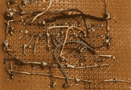 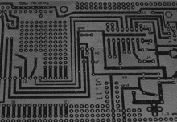
对于你的第一个电路板，一个目标是保持电路单面，这样你就可以使用单面覆铜进行蚀刻。这将让你在进入双面之前获得一些经验。如果需要顶部走线，只需在顶部布设几根跳线。你可以[尝试](http://www.rollette.com/hackaday/)许多完整的电路布局，比如[黑客一日设计挑战赛冠军](http://www.hackaday.com/2007/03/02/the-design-challenge-winner/)。

这是生产单面纸板所需的材料清单。除了覆铜钻和 PCB 钻之外，这份清单上的所有东西都可以在当地商店买到。

材料: [Muratic acid](http://en.wikipedia.org/wiki/Hydrochloric_acid) 、普通家用过氧化氢、安全护目镜、优质杂志页(切割成 8×11)、激光打印机、单面 1 盎司覆铜、一个可放入纸板的塑料容器、软塑料刷、衣服熨斗、油漆稀释剂、橡胶手套、纸巾、锡剪、钻头或旋转工具、PCB 钻头、Scotch Brite 擦洗垫、良好通风、装满水的 5 加仑塑料桶。

现在，你可以这样做:

在高质量杂志的一张纸上打印底侧层。使用杂志中的一页，杂志纸越厚越亮越好，但是不要使用封面。你必须使用激光打印机，而不是喷墨打印机。如果您的打印机使用墨盒而不是碳粉盒，它将无法工作。如果您没有激光打印机，您可以通过打印到白纸上并使用设置为最暗的复印机将版面复制到杂志纸上来解决这个问题。如果打印机卡纸，说明你使用的杂志页不够厚。同样，不要使用杂志封面，因为它们不起作用。

用杂志页是因为效果好，而且便宜！他们工作的原因是因为纸张非常光滑，碳粉不能很好地附着在光滑的页面上。杂志页面上使用的印刷是墨水，它不会脱落，但碳粉会脱落。[碳粉](http://en.wikipedia.org/wiki/Toner)实际上是一种塑料聚合物，不同的碳粉可能会产生不同的效果。根据我们的经验，使用惠普原装硒鼓非常成功；一个 Office Max 品牌收效甚微。碳粉的唯一目的是保护其下方的铜不被蚀刻掉，您只希望未覆盖的区域被蚀刻掉。

接下来，洗手去除任何油脂。打印完页面后，尽量减少操作，不要用手指触摸激光打印机；这可能会在印刷品上沾上油污。尽可能保持页面平整。

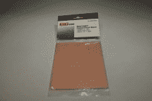 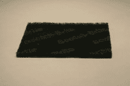
非常小心地，从包装中取出覆铜板。出于与上述相同的原因，请勿触摸铜表面。如果需要，您可以使用锡剪将覆铜板切割成合适的尺寸。使用 Scotch Brite 擦洗垫轻轻打磨表面(Scotch Brite 是一种流行的塑料擦洗垫品牌，旨在模仿钢丝绒)。不要使用钢丝绒，因为它会将钢嵌入铜中。用微湿的纸巾擦去残留的灰尘。

找一个坚硬、平坦、坚固、耐热的表面。把熨斗里的水倒出来，把熨斗调到最热的温度。让熨斗变热。

这是一块覆铜的两面。将空白面朝下，铜面朝上。将印刷/纸张对准覆铜板，印刷面向铜。不要让它移动。

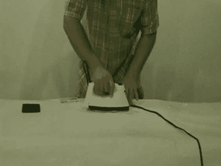
将熨斗牢牢压在杂志纸的背面，将它夹在覆铜板和熨斗之间。在不移动熨斗的情况下用力按压，保持熨斗完全静止一分钟。在这一分钟内不要移动熨斗，用力推，非常用力！

然后，在四分钟内，慢慢移动熨斗，确保在纸上施加很大的压力，但不要让纸在铜片上滑动。完成后，让板子完全冷却后再移动。这将使碳粉附着在铜上，防止您被烧伤。

将木板放入冷水中浸泡五分钟。五分钟后，试着从纸板上撕下湿纸，只留下激光打印机上的墨粉/印刷品。只有碳粉会附着在铜上。如果纸不容易脱落，就让它在水里多泡一会儿。如有必要，用手指摩擦去除任何纸张，只留下碳粉。如果有一些多余的纸纤维粘在碳粉上也没关系。

如果发现不是每个痕迹都附着在覆铜板上或者没有对齐，用漆稀释剂和纸巾清除铜板上的墨粉，重新开始。如果痕迹看起来不错，那么继续前进。仔细检查痕迹，但是，因为你现在看到的将是你的成品。

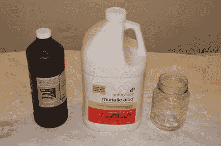
在通风良好、有风扇的地方，向塑料容器中加入 2 杯过氧化氢。轻轻倒入 1 杯盐酸，形成蚀刻溶液。始终佩戴护目镜、手套，不要吸入烟雾。不要将任何金属容器、量杯、不锈钢水槽或工具与这种混合物一起使用，因为这种混合物会侵蚀金属。酸安全，想想“三 A”，因为总是添加酸，容器中的任何东西最终都会飞溅出来。这种蚀刻溶液虽然是用普通化学品制成的，但应该受到尊重。这对你自己和周围环境都是危险的，请尊重它。[氯化铁](http://en.wikipedia.org/wiki/Iron%28III%29_chloride)是另一种常见的蚀刻溶液，使用起来并不安全，两者同样危险。

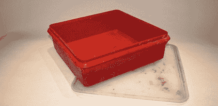
将板的铜面朝上放入盛有蚀刻液的塑料容器中。使用软塑料刷轻轻擦拭电路板。你会注意到铜开始溶解。大约需要 3-4 分钟来溶解所有暴露的铜。你只需要观察，以确保它在轨迹之间的所有区域都消失了。不要将电路板放在蚀刻混合物中太久，因为走线会溶解在保护它们的墨粉下。

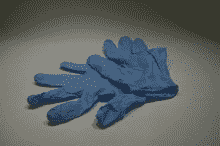 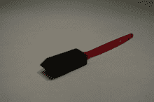
戴上橡胶手套，从 t
he 蚀刻液中取出板，检查露出的铜是否全部溶解。如果不是，把板子放回去，用塑料刷刷这个区域。如果溶解，在水下冲洗电路板一分钟，将其清洗干净。用纸巾擦干木板。

此时，溶液被耗尽，因为所有的铜都溶解在其中。将溶液稀释在一桶 5 加仑的水中进行处理。当与一桶 5 加仑的水混合时，我们送出进行分析的水样中的酸含量和铜含量远低于测试限值(您所在地区的限制可能不同)。您可以通过不蚀刻电路板上不需要的区域来进一步减少溶液中的铜含量。考虑在较大的开放区域增加接地层，在制作较小的电路板时使用较少的蚀刻剂。

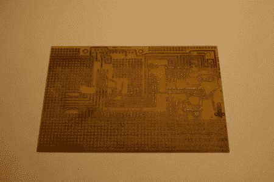
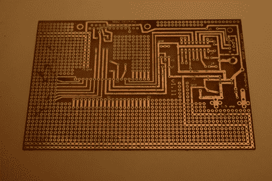
使用油漆稀释剂(油漆稀释剂和丙酮效果不佳)和纸巾去除残留在铜痕迹上的任何墨粉。

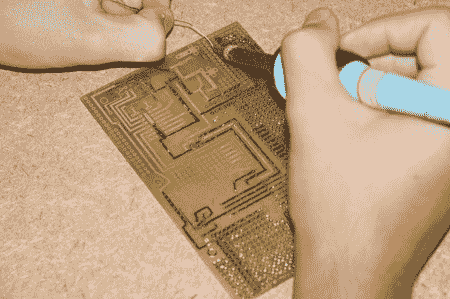
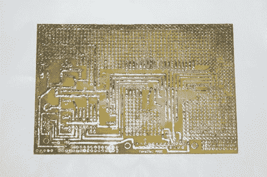
镀锡可以防止铜氧化，从而使其难以焊接。如果你愿意，你可以现在就用焊锡和烙铁给所有的痕迹上锡。这实际上使钻孔更容易，因为它有助于钻头居中。如果这样做，请确保清除多余的焊剂。你可以用 [Tinit](http://shop.vetcosurplus.com/catalog/product_info.php?products_id=942) 化学镀铜。这里有一个[不同的教程](http://eegeek.net/electronics/tutorials/tinnittutorial.htm)描述它的用法。

使用正确尺寸的 PCB 钻头和旋转工具钻通孔零件的所有孔。用普通钻钻大的安装孔。PCB 钻头是硬质合金，用于钻透玻璃纤维，这将很快使标准钻头变钝。有几种非常常见的钻头尺寸，它们通常成包出售。我们对 IC 孔使用 0.0260 英寸，对电阻和电容使用 0.0310 英寸。

在杂志纸上打印出顶部丝印层，并使用与上述相同的过程将其熨烫到顶部。再次，在水下运行，并剥离纸。现在，组件 ID 显示在顶部。

这是一个使用基本相同方法的不同视频:

使用这种简单的方法，您可以制作出非常好的 PCB，我们期待看到您未来的项目使用这种方法进入 [tip line](http://www.hackaday.com/contact/tips/) 。在[指南类别](http://www.hackaday.com/category/how-to/)中寻找更多类似这样的指南。