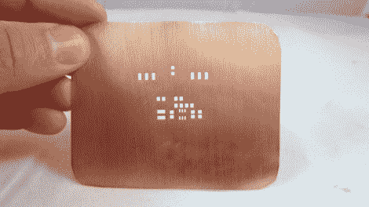

# 如何蚀刻自己的锡膏模板

> 原文：<https://hackaday.com/2011/12/21/how-to-etch-your-own-solder-paste-stencils/>

我们有点惊讶我们以前没有涉及这一概念，因为它只使用了家用 PCB 制造常用的技术。使用与电路板相同的蚀刻技术，用一片铜片制作了这个焊膏模板。他设计并印刷了一个抗蚀剂图案，除了模板上应该有孔的地方，到处都是墨粉。他用熨斗将墨粉转印到铜片上。

这里的区别应该很明显；这是一张没有衬底的薄铜片。因此，你必须在蚀刻前保护铜表面。他用包装带把整个东西的两面都包了起来。之后，它进入氯化铜浴溶解暴露的部分。一旦胶带和墨粉被移除，您可以在您的电路板上刮出精确数量的焊膏。

这并不适合每一个人，但是如果你正在组装许多电路板，这是一个不错的方法。如果模板不再使用，它可以被回收，但我们不知道铜的腐蚀会如何影响模板的性能。

这个技术的想法来自于[一个已经存在多年的向导](http://www.instructables.com/id/Making-stencils-for-solder-paste-at-home/)。