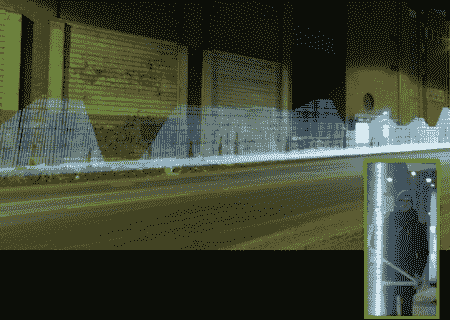

# 如何找到 WiFi:携带大棒，使用长时间曝光

> 原文：<https://hackaday.com/2011/03/02/how-to-find-wifi-carry-a-big-stick-and-use-long-exposures/>

这里有一个艺术的方法来绘制你周围的无线网络；使用一个大灯杆和长时间曝光将它们绘制在照片上。这种捕捉方法通常被称为[光绘](http://hackaday.com/2010/09/17/3d-digital-light-art-using-ipad-and-camera-trickery/)，利用发光二极管的相对亮度来拉伸静止图像——在快门打开时快速移动操纵杆。

这个项目中使用的四米高的杆可以容纳 80 个白色 led。Arduino 和 WiFi 盾一起检测设备周围网络的相对信号强度。用这种方法产生的图像非常令人愉快，休息后你会喜欢看视频的。我们只是希望有某种谷歌街景界面来分享这些数据，因为有人必须带着这种看起来相当奇怪的设备出去敲打路面，以便在第一时间收集数据。

【维梅奥 http://vimeo.com/20412632 w = 470】

[谢谢邓肯]