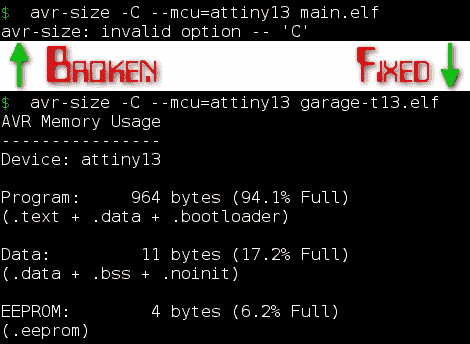

# 如何在 Ubuntu 10.04 上修复 AVR-SIZE

> 原文：<https://hackaday.com/2010/09/01/how-to-fix-avr-size-on-ubuntu-10-04/>



avr-size 程序是 AVR-GCC 工具链的一部分，用于开发该系列微处理器的程序。程序告诉你代码将在芯片上占据多少空间，如果你试图把一个程序塞进一个小的程序存储器，这是很重要的信息。也许更重要的是，它向您显示了使用了多少 ram。这是上面图像的“数据:”部分，如果你溢出内存，这将是唯一让你知道已经发生的事情(除了程序运行时的不稳定行为)。

很长一段时间以来，Ubuntu 中的 avr 大小的包一直缺少一个关键特性，这个特性使信息更容易被人阅读。mightyohm 的[Jeff]在 bug 追踪器上找到了问题的解决方案，并发布了关于如何更新您的副本的[说明](http://mightyohm.com/blog/2010/08/fix-for-broken-avr-size-in-ubuntu-10-04-lucid/)。基本上就是从 Debian(一个已经打好补丁的上游副本)下载包并安装。[Jeff 的]指南基于 AMD64 版本，因此我们在休息后以更通用的方式复制了他的过程。

1.首先，[到这里](http://ftp.us.debian.org/debian/pool/main/b/binutils-avr/)下载适合您的架构的软件包。最常见的是 i386，您应该下载最新的修订版号(在撰写本文时为 2.20.1-1)。

2.使用 Debian 软件包管理系统安装您刚刚下载的软件包(如果您没有下载 i386 版本，您需要更改软件包名称):

```
sudo dpkg -i binutils-avr_2.20.1-1_i386.deb
```

3.暂停程序包以防止自动更新实际降级回损坏的版本:

```
echo &quot;binutils-avr hold&quot; | sudo dpkg --set-selections
```

这就是全部了。我们喜欢使用一个 makefile 来编译和上传我们的 AVR 代码。我们已经做了必要的更改，以使用固定 avr 大小的程序。[在此下载 makefile 文件](http://blog.mahalo.com/hackaday/misc/makefile)。