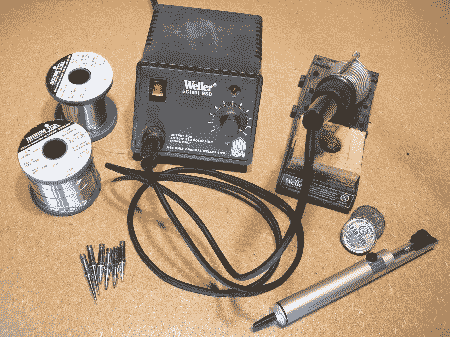
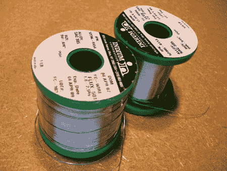
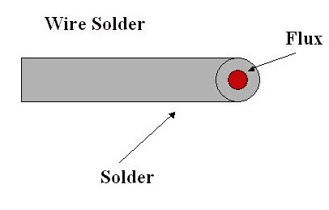
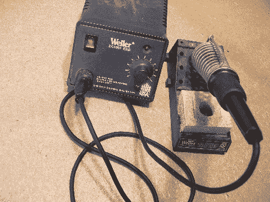
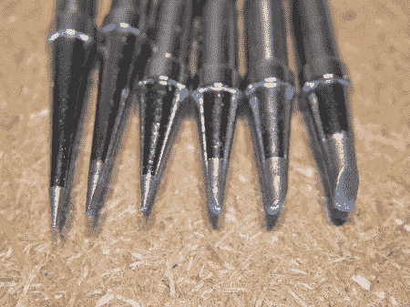
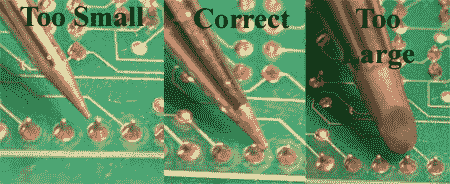
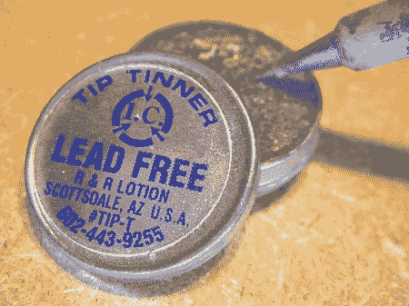
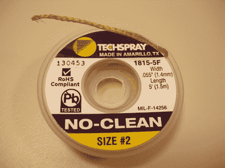

# 如何:使用无铅焊料走向绿色

> 原文：<https://hackaday.com/2008/05/22/how-to-go-green-with-lead-free-solder/>

我们过去报道过许多[Jason Rollette]的个人项目，很高兴欢迎他成为我们最新的 Hack-A-Day 撰稿人。

电子行业已经转向无铅合规，但大多数爱好者甚至没有考虑过使用铅对个人的影响。今天的方法将涵盖从锡/铅焊料转变为完全无铅焊料的过程。我们之前的帖子[锡焊介绍](http://www.hackaday.com/2007/10/26/how-to-introduction-to-soldering/)和[后续](http://www.hackaday.com/2007/10/28/followup-soldering-how-to/)仍然适用于无铅。您可能从未考虑过改用无铅汽油，但我们希望帮助您做出明智的决定。

The reason we are even talking about this is because of the Restriction of Hazardous Substances directive. RoHS was adopted in February 2003 by the European Union; all electronics sold there must comply. The substances restricted are: lead, mercury, cadmium, chromium VI also known as hexavalent chromium plating, and pbb, pbde flame retardants used in plastics. We will focus on lead. Solder joints must contain less than 0.1% lead to be compliant. RoHS is not currently required in the US, but California RoHS, effective September 2003, had a compliance deadline of January 2007.

尽管电子行业是直接目标，但它只占制造业所用铅的一小部分。电池行业消耗了近 80%的人造铅。轮胎车轮重量也占了较大的百分比。  There are some good reasons for the hobbyist to convert to lead free solder, both personal safety and environmental. Lead poisoning can occur when lead enters the body through inhalation, ingestion or dermal contact such as direct contact to mouth, nose, eyes, and skin lesions. Even if you keep using tin/lead solder, wash your hands before and after you do anything. Most poisoning cases are from lead building up over time. The main environmental issue is lead leaching into drinking water or watersheds when disposed of improperly.  

无铅焊料有许多不同的品种。两种合金似乎是最受欢迎的:SAC305 含有 96.5%的锡、3%的银和 0.5%的铜，熔点约为 217℃，SN100 含有 99.3%的锡、0.6%的铜以及一些镍和银，熔点约为 228℃。选择你觉得合适的合金和品牌。将这些合金与传统的 63%锡和 37%铅熔体进行比较，后者的熔点约为 183℃。更高的熔点是无铅更难使用的部分原因。我们使用 SAC305 和一个“不干净”的药芯。

除了挑选合金，你还需要决定直径。对于 SMT，我们建议使用 0.032 英寸、0.020 英寸和 0.015 英寸的通孔。选择正确直径的焊料对成功非常重要。 成品关节从侧面看应该像一个小小的好时之吻，而不是膨胀的气球。正确的直径焊料使这更容易控制。

带有温度调节的高瓦数烙铁是精密工作的最佳选择。买一个烙铁，它有几种不同尺寸的可更换烙铁头，适合不同的焊接应用。有一个好的烙铁会使无铅焊接更容易，因为它的熔点更高。这也有助于保持尽可能短的停留时间，减少过热对部件造成的损坏。

对于一个初学焊接的人来说，选择合适尺寸的焊嘴可能是最重要的部分。无铅更不宽容，正确的提示将大大有助于防止缺陷。

使用太小的齿尖将花费更长的时间，滥用齿尖，并且不能有效地将热量传递到关节。小小费会显得太冷或太慢。

使用太大的焊嘴会损坏电路板，过热并损坏零件，过早地烧掉焊剂会导致焊接不良。

使用无铅吸头。无铅吸头的使用寿命最长。熨斗温度应该设置在 700-800 华氏度。不要用压力来弥补润湿和传热的不足；这将导致电路板损坏。通过提供最佳的接触面积来优化热传递。 

与锡/铅焊接的区别

锡/铅焊料不应与无铅焊料混合，因为它会降低接头的强度。无铅零件可以使用锡/铅焊料。你应该尝试订购所有的零件，集成电路，电阻，帽，原型板等。无铅，即使你还没有使用无铅焊料。这将为你将来的转换提供便利。 助焊剂和吸头清洁剂等消耗品应经过无铅焊接认证。助焊剂需要承受更高的温度和更长的停留时间，一些吸头清洁剂中含有锡/铅焊料，可能会污染无铅焊点。

 

不是所有的焊剂都能承受高焊接温度。助焊剂炭化，被称为“黑尖综合症”，发生在不能加热的助焊剂使尖变黑，使重新镀锡几乎不可能的时候。当这种情况发生时，热传递严重减少。购买兼容的焊剂是关键。

正如我们多次说过的:你需要将烙铁的温度设置得比你习惯的温度稍高。您还会注意到，由于熔点较高，需要稍长的停留时间。与锡/铅相比，润湿或扩散也稍慢。与闪亮的锡/铅相比，最终的无铅焊点会显得有些粗糙和暗淡。

铁必须保持清洁，并完全涂上焊料合金，否则在较高温度下会发生氧化。焊料尖端需要更频繁地清洗和镀锡。使用湿海绵清洁，并通过添加少量焊料来保持尖端镀锡。一般来说，使用无铅合金时，所有齿尖的寿命都会缩短。

无铅焊料更容易产生焊桥(短路)。[锡须](http://www.metalwhiskers.com/moxie/articles/metal-whiskers.shtml)生长在高锡合金中也是可能的，但了解甚少。

所需的温度使无铅焊接成为一种不同的体验，但并非遥不可及。如果可以用锡/铅焊料焊接，就可以用无铅焊料焊接。如果你焊接有问题，也许这里的一些提示会有帮助。记住，焊接需要练习；在尝试一个项目之前，焊接、脱焊、再焊接一些来自计算机或消费电子产品的旧电路板。否则你不能期待一个完美的结果。知识、实践和经验将为出色的手工焊接结果提供所需的一致性。请分享你的无铅工作经验。

