# 操作方法:焊接介绍

> 原文：<https://hackaday.com/2007/10/26/how-to-introduction-to-soldering/>

我们已经有一段时间没有一个新的每日黑客指南了，坦白地说，我们很想念它们。为了让事情运转起来，[艾略特]和我想建立一个良好的知识库，以帮助你黑你自己的东西。我知道焊接对我们的许多读者来说并不新鲜，但每个人都有开始的时候。我们的希望很简单:这一系列新的操作指南将有助于启发新的和有经验的黑客。

拥有合适的工具和工作空间是成功焊接的关键。实际的技术非常简单。我们将涵盖您需要的所有基本工具，良好焊接的关键，以及如何消除您的错误或从旧硬件中收获组件。

你首先需要一个像样的烙铁。[韦勒](http://www.cooperhandtools.com/brands/weller/)生产的产品还不错，但是 [RadioShack 的](http://www.radioshack.com/family/index.jsp?categoryId=2032313&cp=2032058.2032236)非常便宜，如果你赶时间的话。我最喜欢的熨斗是带 led 温度显示的温控天马(不幸的是，它和我的示波器一起从一个蹩脚的存储设备中丢失了)。

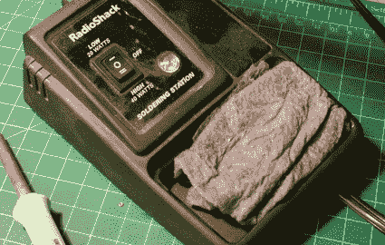
大多数焊台自带海绵；它们会丢失，并且倾向于抓住一些焊料。我其实更喜欢用纸巾来代替。不管怎样，把它弄湿，挤一挤，这样它就不会湿透了。如果它干了，当你在它上面擦你的熨斗的时候它会燃烧。

购买合适的焊料也同样重要。它有各种厚度、金属合金和芯类型。我就不深究合金了。一般你要 60/40 (60%锡，40%铅)。大多数现代电子产品是无铅的，但是对于业余爱好来说，含铅是可以的。洗完手就行了！为管道工程生产的焊料通常很厚(左手边)并且有一个固体金属芯(或者更糟:酸性芯)。对于电子工作，你肯定需要松香芯。松香作为焊料的助焊剂，允许它流到金属上并附着在金属上。你当然可以使用液态助焊剂/松香，但是在当地通常不容易找到。对于厚度，我总是买我能找到的最薄的松香芯。总结一下:你要薄，松香芯，60/40 焊料。

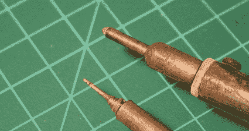
并非所有的铁尖都是生而平等的。对于精细的工作，我总是伸手拿我的 15 瓦韦勒铅笔铁。它有我能找到的最小的尖端，我用旋转工具在尖端磨了一个更细的点。bigger iron 是一个便宜的 RadioShack 站，我把它放在我的办公室里，为同事们提供帮助。

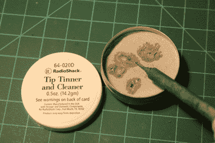
烙铁的尖端偶尔需要一点保养。如果烙铁的末端没有镀锡，比如当你擦拭它的时候，它会发亮，你将很难让焊料熔化。把这种东西想象成你的铁的一种浮石。将熨斗加热，并在清洁剂中摩擦顶端。清洁剂会融化一点，你的烙铁会比以往任何时候都好用。

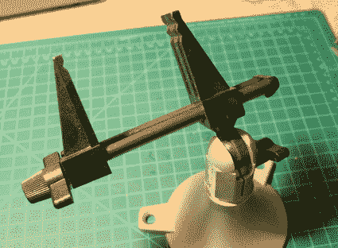
牢固地拿着工件很重要，但你的手会忙于烙铁和焊锡。我目前最喜欢的工具是这个 [Panavise Jr.](http://www.panavise.com/f/vises/vises_combo.html) 大约 25 美元。感谢 [Ladyada](http://www.adafruit.com/) 在不知不觉中让我转向 Panavise 产品。如果你需要更便宜的东西，你可以得到一套帮助之手——这是一套连接到加重底座的鳄鱼夹。他们工作得很好，我仍然用他们做较小的焊接项目。

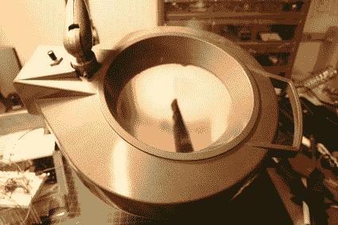
有些项目需要格外精细地关注细节。当目视检查短路和处理表面贴装问题时，一个巨大的放大镜灯就派上了用场(我从祖母那里继承了这个灯)。没有它你也能过得很好，但是当你需要在非常小的部件上工作或者当你的眼睛累了的时候，它们是很棒的。

对于一次性项目，RadioShack 的原型板非常方便。它们便宜、易得，连接起来也很简单，只需将焊料跨接在铜焊盘上。

在投入时间将零件焊接在一起之前，最好先制作电路原型。像这样的试验板对于防止以后的挫折非常有用。当我试图买我的第一个时，我大约 10 岁。没有人知道我到底在说什么，当地的无线电黑客显然没有库存。RadioShack 的人一直想卖给我厨房砧板。在怀疑[ [福里斯特·米姆斯](http://www.forrestmims.com/)是不是疯了大约一年后，我终于访问了另一个真正拥有它们的 RadioShack。

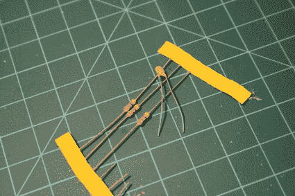
不要烤你的比特。像电阻或小型陶瓷电容这样的无源元件通常不会因为受热而出现任何问题，但你仍然应该注意你用烙铁加热它们的时间。如果你在获得正确的焊点方面有问题，让零件休息几分钟，这样它们就有机会在两轮焊接之间冷却下来。

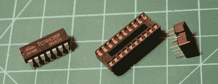
像这种逻辑芯片的集成电路，通常对热和静电的敏感程度远远超过无源元件。插座是防止芯片烧坏的廉价保险。

RadioShack 出售红色手柄的小夹子作为散热器。没关系，但是像上面这样的普通止血器效果更好。当你焊接电线的时候，它们也可以很好的保护你的手指尖不被烫伤。

要成功焊接一个元件，不要把焊料熔化在铁上。将烙铁靠着电路板(焊盘)上的铜和要连接的元件。给熨斗一点时间加热它们。然后熔化元件上的焊料，如果需要的话，熔化铜焊盘。

不要熔化烙铁顶端的焊料。有时有必要在烙铁上熔化少量焊料以促进热传递，但为了实现良好的连接，您希望焊料熔化并流到元件引线上。

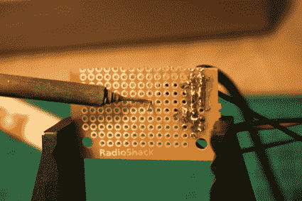
在使用焊料之前，用熨斗加热元件！

一旦连接好了，烙铁可以用来从连接处去除少量多余的焊料。

用湿海绵或纸巾擦拭锡膏并烧掉松香。

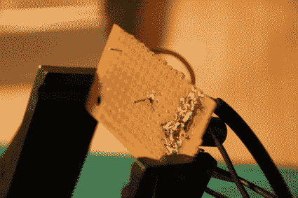
如果焊料流到元件的铜焊盘和引线上，则连接应该良好。

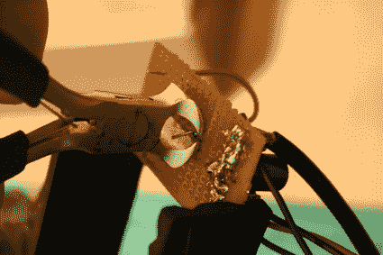
现在你需要修剪元件多余的引线。如果你用斜切刀，你切下的那块很可能会飞向空中。这些平切刀是我最喜欢的:金属线保持不动，产生的边缘几乎不锋利。

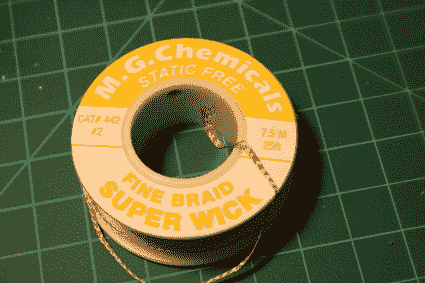
人无完人。有时我们需要删除一个坏的组件或撤销一个错误。脱焊编织有点像海绵吸收多余的焊料。

要脱焊某物，只需将编织物放在目标上，然后将烙铁放在顶部。热量应该通过编织物传递，熔化的焊料将像油一样通过灯芯流到铜上。对于较大量的焊料，我通常拉出我的大铁块。对于少量，甚至铅笔铁做的把戏。

对于较大的拆焊工作，如回收部件，拆焊烙铁能创造奇迹。越热越好，所以使用前让它预热一段时间。

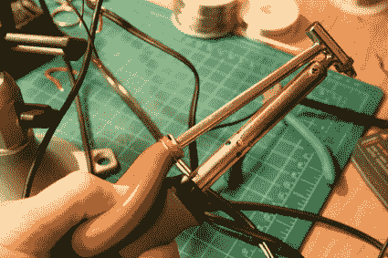
用熨斗接触板子之前，先用拇指压住灯泡。

一旦就位，给它一点时间加热焊料并松开灯泡。灯泡通过中空的顶端吸取焊料。较大的组件可能会受到几次撞击，但较小的组件通常只需要一次拉动。

我们已经涵盖了所有的基础知识:工具、焊接和脱焊。如果你正在寻找一个好的起步项目，我强烈建议尝试制作自己的耳机放大器。我用 RadioShack 的零件制造了这个[(我的零件箱里有一些高端运算放大器)。这是一个回报丰厚、成本低廉的项目。如果你想要一个更加生动的指南，可以看看美国宇航局的这些基本的](http://biobug.org/audio/cmoy/)[视频](http://radiojove.gsfc.nasa.gov/telescope/soldering.htm)或者甚至是 Solder.net 的这个[视频集](http://www.solder.net/technical/tips.asp)。